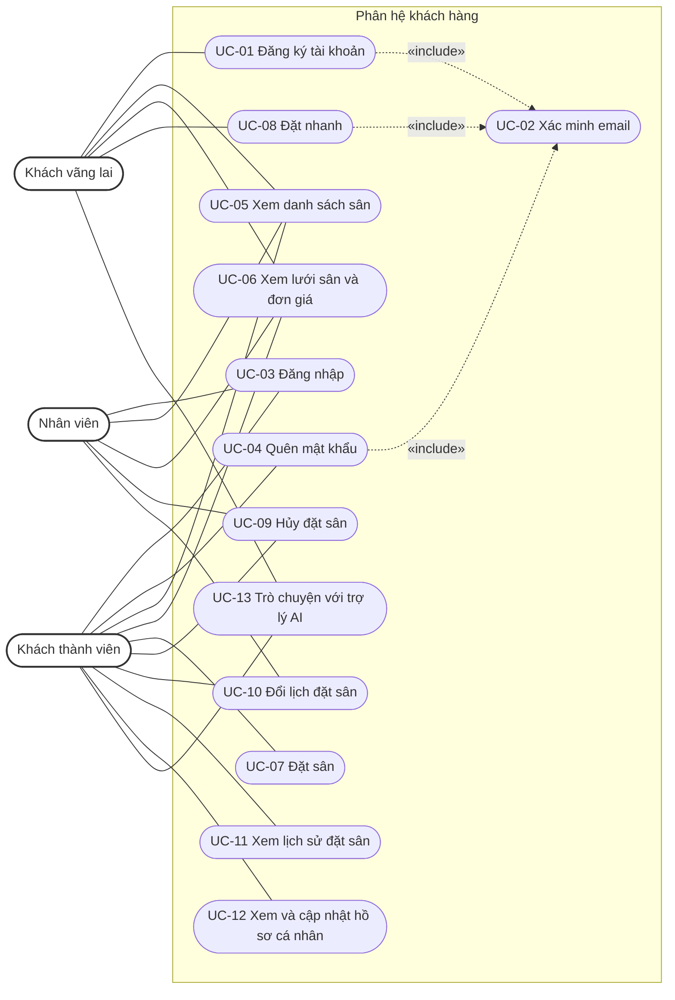
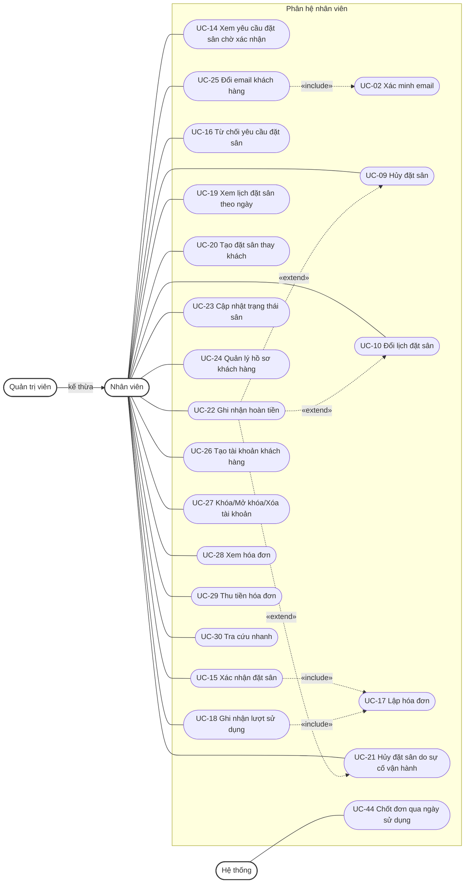
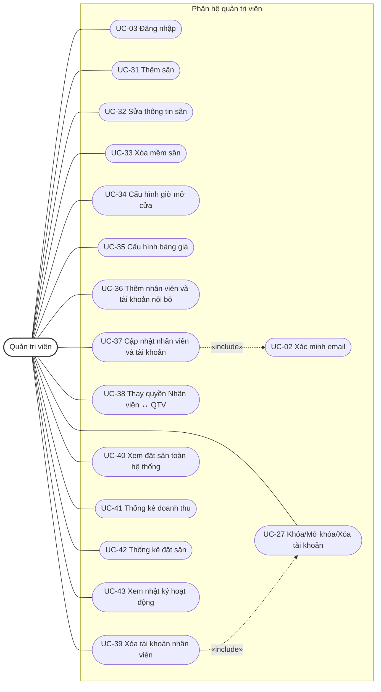

# Mô hình Usecase

**Hệ thống đặt sân cầu lông**

**Version 1.4**

**Sinh viên thực hiện:**

- 24522000 – Nguyễn Bảo Việt
- 24520856 – Đinh Nhật Khôi

## Bảng ghi nhận thay đổi tài liệu

| Ngày | Phiên bản | Mô tả | Tác giả |
| --- | --- | --- | --- |
| 09/10/2026 | 1.0 | Khởi tạo mô hình Use-case từ SRS phiên bản 1.2 | Nguyễn Bảo Việt, Đinh Nhật Khôi |
| 10/10/2026 | 1.1 | Đồng bộ SRS 1.3: bỏ tạo đơn cho lượt đã diễn ra | Nguyễn Bảo Việt, Đinh Nhật Khôi |
| 10/10/2026 | 1.2 | Đồng bộ SRS 1.4: trạng thái tài khoản, hard-delete và phạm vi phiên | Nguyễn Bảo Việt, Đinh Nhật Khôi |
| 10/10/2026 | 1.3 | Đồng bộ SRS 1.5: bỏ lịch mở kế hoạch/tỷ lệ lấp đầy; rút gọn tài liệu | Nguyễn Bảo Việt, Đinh Nhật Khôi |
| 10/10/2026 | 1.4 | Rà soát với SRS 1.5, thiết kế dữ liệu 1.5 và template: đủ các mục đặc tả theo template; bảng danh sách use-case theo 3 cột của template; UC-10 ghi nhật ký (không ghi chuyển trạng thái khi trạng thái không đổi); bổ sung nhật ký, mã chống gửi lặp, email, kiểm tra trùng lịch còn thiếu | Nguyễn Bảo Việt, Đinh Nhật Khôi |

## Mục lục

1. Sơ đồ Use-case
2. Danh sách các Actor
3. Danh sách các Use-case
4. Đặc tả Use-case
   - 4.1 – 4.13: Phân hệ khách hàng (UC-01 – UC-13)
   - 4.14 – 4.30: Phân hệ nhân viên (UC-14 – UC-30)
   - 4.31 – 4.43: Phân hệ quản trị viên (UC-31 – UC-43)
   - 4.44: Tác vụ tự động của hệ thống (UC-44)

---

## 1. Sơ đồ Use-case

Sơ đồ chia theo phân hệ để dễ đọc. Quản trị viên (QTV) kế thừa mọi use-case của Nhân viên.

### 1.1 Phân hệ khách hàng

### 1.2 Phân hệ nhân viên

### 1.3 Phân hệ quản trị viên

---

## 2. Danh sách các Actor

| STT | Tên Actor | Ý nghĩa/Ghi chú |
| --- | --- | --- |
| 1 | Khách vãng lai | Người đặt nhanh khi chưa đăng nhập (họ tên, số điện thoại, email); xem sân, lưới sân, giá; dùng trợ lý AI. |
| 2 | Khách thành viên | Khách hàng có tài khoản; đặt, hủy, đổi lịch, xem lịch sử và hồ sơ của mình. Đăng nhập/quên mật khẩu do khách này thực hiện trước khi có phiên. |
| 3 | Nhân viên | Người dùng nội bộ có tài khoản do QTV cấp; xử lý đặt sân, khách hàng, hóa đơn, trạng thái sân. |
| 4 | Quản trị viên (QTV) | Nhân viên có quyền quản trị; kế thừa mọi quyền của Nhân viên, thêm quản lý sân, giá, tài khoản nội bộ, thống kê, nhật ký. Trong mục 4, use-case ghi actor "Nhân viên" thì QTV cũng thực hiện được. |
| 5 | Hệ thống | Tác vụ tự động chốt đơn lúc 00:00 giờ Việt Nam (BR-17). |

---

---

## 3. Danh sách các Use-case

| STT | Tên Use-case | Ý nghĩa/Ghi chú |
| --- | --- | --- |
| 1 | UC-01 Đăng ký tài khoản | Actor: Khách vãng lai. Tự đăng ký tài khoản, liên kết hồ sơ Khách hàng. |
| 2 | UC-02 Xác minh email | Actor: theo use-case gọi đến. Xác minh quyền dùng email bằng mã 6 chữ số. |
| 3 | UC-03 Đăng nhập | Actor: Khách thành viên, Nhân viên, QTV. Đăng nhập bằng email và mật khẩu. |
| 4 | UC-04 Quên mật khẩu | Actor: Khách thành viên. Đặt lại mật khẩu sau khi xác minh email. |
| 5 | UC-05 Xem danh sách sân | Actor: Khách vãng lai, Khách thành viên, Nhân viên. Xem tên, mô tả, trạng thái sân. |
| 6 | UC-06 Xem lưới sân và đơn giá | Actor: Khách vãng lai, Khách thành viên, Nhân viên. Xem tình trạng slot theo ngày và đơn giá theo khung giờ. |
| 7 | UC-07 Đặt sân | Actor: Khách thành viên. Tạo đặt sân ở trạng thái Chờ xác nhận. |
| 8 | UC-08 Đặt nhanh | Actor: Khách vãng lai. Đặt sân không cần tài khoản, có xác minh email. |
| 9 | UC-09 Hủy đặt sân | Actor: Khách thành viên, Nhân viên. Hủy đơn theo yêu cầu khách (nhân viên làm thay được). |
| 10 | UC-10 Đổi lịch đặt sân | Actor: Khách thành viên, Nhân viên. Đổi sân/ngày/giờ của đơn. |
| 11 | UC-11 Xem lịch sử đặt sân | Actor: Khách thành viên. Xem danh sách và chi tiết đơn của mình. |
| 12 | UC-12 Xem và cập nhật hồ sơ cá nhân | Actor: Khách thành viên. Xem hồ sơ; chỉ sửa họ tên, số điện thoại. |
| 13 | UC-13 Trò chuyện với trợ lý AI | Actor: Khách vãng lai, Khách thành viên. Tư vấn dựa trên dữ liệu công khai. |
| 14 | UC-14 Xem yêu cầu đặt sân chờ xác nhận | Actor: Nhân viên. Xem danh sách và chi tiết đơn Chờ xác nhận. |
| 15 | UC-15 Xác nhận đặt sân | Actor: Nhân viên. Chuyển Chờ xác nhận → Đã xác nhận và lập hóa đơn. |
| 16 | UC-16 Từ chối yêu cầu đặt sân | Actor: Nhân viên. Hủy đơn Chờ xác nhận kèm lý do. |
| 17 | UC-17 Lập hóa đơn | Actor: Nhân viên. Tạo hóa đơn cho đơn trong cùng giao dịch. |
| 18 | UC-18 Ghi nhận lượt sử dụng | Actor: Nhân viên. Chuyển đơn đã tồn tại sang Hoàn thành sau khi khách đã sử dụng và lượt đã kết thúc. |
| 19 | UC-19 Xem lịch đặt sân theo ngày | Actor: Nhân viên. Xem lưới đặt sân theo ngày, gồm slot trống. |
| 20 | UC-20 Tạo đặt sân thay khách | Actor: Nhân viên. Tạo đơn Chờ xác nhận tại quầy/hotline. |
| 21 | UC-21 Hủy đặt sân do sự cố vận hành | Actor: Nhân viên. Hủy đơn vì sân không phục vụ được, kể cả quá mốc 1 giờ. |
| 22 | UC-22 Ghi nhận hoàn tiền | Actor: Nhân viên. Ghi nhận hoàn toàn bộ tiền đã thu (hoàn ngoài hệ thống). |
| 23 | UC-23 Cập nhật trạng thái sân | Actor: Nhân viên. Đổi giữa Hoạt động, Bảo trì, Đóng. |
| 24 | UC-24 Quản lý hồ sơ khách hàng | Actor: Nhân viên. Xem, tìm, cập nhật hồ sơ khách và các đặt sân của khách. |
| 25 | UC-25 Đổi email khách hàng | Actor: Nhân viên. Đổi email hồ sơ và email đăng nhập, không gộp hồ sơ. |
| 26 | UC-26 Tạo tài khoản khách hàng | Actor: Nhân viên. Tạo tài khoản khách, tái sử dụng hồ sơ nếu có. |
| 27 | UC-27 Khóa/Mở khóa/Xóa tài khoản | Actor: Nhân viên, QTV. Khóa/mở khóa (nhân viên: tài khoản khách); QTV được hard-delete tài khoản, giữ hồ sơ lịch sử. |
| 28 | UC-28 Xem hóa đơn | Actor: Nhân viên. Xem, lọc, tìm hóa đơn và chuỗi hóa đơn thay thế. |
| 29 | UC-29 Thu tiền hóa đơn | Actor: Nhân viên. Ghi nhận thu đủ tiền hóa đơn Chưa thanh toán. |
| 30 | UC-30 Tra cứu nhanh | Actor: Nhân viên. Tìm khách và đặt sân theo số điện thoại, email, mã đặt sân. |
| 31 | UC-31 Thêm sân | Actor: QTV. Tạo sân cùng 7 lịch và 7 mốc giá mặc định. |
| 32 | UC-32 Sửa thông tin sân | Actor: QTV. Sửa tên, mô tả sân chưa xóa. |
| 33 | UC-33 Xóa mềm sân | Actor: QTV. Chuyển sân sang Đã xóa, giải phóng tên. |
| 34 | UC-34 Cấu hình giờ mở cửa | Actor: QTV. Sửa giờ mở/đóng, khả dụng theo ngày trong tuần. |
| 35 | UC-35 Cấu hình bảng giá | Actor: QTV. Sửa bảng mốc giá theo sân và ngày trong tuần. |
| 36 | UC-36 Thêm nhân viên và tài khoản nội bộ | Actor: QTV. Tạo hồ sơ Nhân viên và tài khoản đăng nhập. |
| 37 | UC-37 Cập nhật nhân viên và tài khoản | Actor: QTV. Sửa họ tên, số điện thoại, email nhân viên. |
| 38 | UC-38 Thay quyền Nhân viên ↔ QTV | Actor: QTV. Đổi quyền trên hồ sơ Nhân viên. |
| 39 | UC-39 Xóa tài khoản nhân viên | Actor: QTV. Hard-delete tài khoản nhân viên, giữ hồ sơ và liên kết lịch sử. |
| 40 | UC-40 Xem đặt sân toàn hệ thống | Actor: QTV. Lọc và xem mọi đặt sân kèm lịch sử trạng thái. |
| 41 | UC-41 Thống kê doanh thu | Actor: QTV. Doanh thu theo khoảng thời gian, theo ngày/tháng. |
| 42 | UC-42 Thống kê đặt sân | Actor: QTV. Lượt/giờ đặt và lượt/giờ Hoàn thành. |
| 43 | UC-43 Xem nhật ký hoạt động | Actor: QTV. Xem và lọc nhật ký chỉ đọc. |
| 44 | UC-44 Chốt đơn qua ngày sử dụng | Actor: Hệ thống. Tự chốt đơn quá ngày lúc 00:00 giờ Việt Nam. |

Ghi chú: yêu cầu NV-23 (hiển thị số hotline) chỉ là thông tin tĩnh trên hệ thống, không lập use-case riêng; được nêu trong UC-09.

---

---

## 4. Đặc tả Use-case

> Mỗi use-case được đặc tả đủ các mục theo template. Mục không có nội dung trong SRS hoặc không áp dụng ghi "—" (Độ ưu tiên, Tần suất sử dụng, Giả định, Luồng thay thế, Includes, Extends). "Người tạo" và "Người cập nhật gần nhất" là nhóm sinh viên thực hiện. Mục "Ghi chú" ghi nguồn tham chiếu trong SRS.

### 4.1 Đặc tả Use-case “Đăng ký tài khoản”

| Mục | Nội dung |
| --- | --- |
| Mã Use Case | UC-01 |
| Tên Use Case | Đăng ký tài khoản |
| Người tạo | Nguyễn Bảo Việt, Đinh Nhật Khôi |
| Người cập nhật gần nhất | Nguyễn Bảo Việt, Đinh Nhật Khôi |
| Ngày tạo | 09/10/2026 |
| Ngày cập nhật gần nhất | 10/10/2026 |
| Actor | Khách vãng lai |
| Mô tả | Khách tự đăng ký tài khoản bằng họ tên, số điện thoại, email, mật khẩu; email là tên đăng nhập. |
| Tiền điều kiện | Email chưa là email đăng nhập của tài khoản nào; hồ sơ cùng email (nếu có) chưa liên kết tài khoản. |
| Hậu điều kiện | Tạo tài khoản khách liên kết đúng một hồ sơ Khách hàng (hồ sơ cũ nếu có, ngược lại hồ sơ mới); ghi nhật ký. |
| Độ ưu tiên | — |
| Tần suất sử dụng | — |
| Luồng chính | 1. Khách nhập họ tên, số điện thoại, email, mật khẩu. 2. Hệ thống kiểm tra dữ liệu. 3. Hệ thống thực hiện UC-02 (mục đích đăng ký). 4. Hệ thống trong một giao dịch: tạo tài khoản, liên kết hồ sơ, tiêu thụ mã xác minh, ghi nhật ký. 5. Hệ thống báo đăng ký thành công. |
| Luồng thay thế | A1. (bước 4) Email đã có hồ sơ chưa liên kết tài khoản: dùng lại hồ sơ đó (mã khách, lịch sử), không ghi đè thông tin cũ bằng dữ liệu form. |
| Ngoại lệ | E1. Dữ liệu không hợp lệ: nêu trường lỗi. E2. Email đã là email đăng nhập hoặc hồ sơ đã có tài khoản: từ chối, hướng dẫn đăng nhập/quên mật khẩu. E3. Xung đột khi tạo đồng thời: hoàn tác, không để lại tài khoản/hồ sơ mồ côi. |
| Includes | UC-02 |
| Extends | — |
| Yêu cầu đặc biệt | Mật khẩu 8–128 ký tự, lưu dạng băm. Email chuẩn hóa; họ tên, số điện thoại, email bắt buộc; không dùng số điện thoại để gộp hồ sơ. |
| Giả định | — |
| Ghi chú | Nguồn SRS: KH-01, KH-02; BR-11, BR-14, BR-26; NFR-01. |

### 4.2 Đặc tả Use-case “Xác minh email”

| Mục | Nội dung |
| --- | --- |
| Mã Use Case | UC-02 |
| Tên Use Case | Xác minh email |
| Người tạo | Nguyễn Bảo Việt, Đinh Nhật Khôi |
| Người cập nhật gần nhất | Nguyễn Bảo Việt, Đinh Nhật Khôi |
| Ngày tạo | 09/10/2026 |
| Ngày cập nhật gần nhất | 10/10/2026 |
| Actor | Actor của use-case gọi đến |
| Mô tả | Gửi và kiểm tra mã 6 chữ số để xác minh quyền dùng email, theo mục đích: đăng ký, đặt lại mật khẩu, đặt nhanh, đổi email. |
| Tiền điều kiện | Email đúng định dạng; chưa vượt giới hạn gửi mã. |
| Hậu điều kiện | Mã đúng, còn hạn, đúng email và mục đích được xác nhận cho use-case gọi đến. |
| Độ ưu tiên | — |
| Tần suất sử dụng | — |
| Luồng chính | 1. Use-case gọi đến yêu cầu gửi mã. 2. Hệ thống chuẩn hóa email, kiểm tra giới hạn gửi và gửi mã (hết hạn sau 10 phút). 3. Người dùng nhập mã. 4. Hệ thống kiểm tra mã đúng, còn hạn, chưa dùng, đúng email và mục đích. 5. Hệ thống trả kết quả xác minh thành công cho use-case gọi đến. |
| Luồng thay thế | A1. (bước 3) Gửi lại: sớm nhất sau 60 giây; mã cũ cùng mục đích bị vô hiệu. |
| Ngoại lệ | E1. Mã sai: báo lỗi; lần sai thứ 5 vô hiệu mã. E2. Mã hết hạn hoặc đã dùng: yêu cầu gửi lại. E3. Vượt giới hạn gửi (5 lần/email/mục đích/giờ; 30 yêu cầu/nguồn truy cập/giờ): trả yêu cầu thử lại sau, không khóa tài khoản đăng nhập. E4. Gửi email lỗi: không báo gửi thành công, không tạo đơn/tài khoản. |
| Includes | — |
| Extends | — |
| Yêu cầu đặc biệt | Mã chỉ lưu dạng băm; dùng một lần; không dùng chéo mục đích; không tiết lộ tài khoản có tồn tại hay trả hồ sơ cũ; bộ đếm sai mã tách khỏi bộ đếm đăng nhập. |
| Giả định | — |
| Ghi chú | Nguồn SRS: BR-26; KH-02; NFR-01. Được include bởi UC-01, UC-04, UC-08, UC-25, UC-37. |

### 4.3 Đặc tả Use-case “Đăng nhập”

| Mục | Nội dung |
| --- | --- |
| Mã Use Case | UC-03 |
| Tên Use Case | Đăng nhập |
| Người tạo | Nguyễn Bảo Việt, Đinh Nhật Khôi |
| Người cập nhật gần nhất | Nguyễn Bảo Việt, Đinh Nhật Khôi |
| Ngày tạo | 09/10/2026 |
| Ngày cập nhật gần nhất | 10/10/2026 |
| Actor | Khách thành viên, Nhân viên, QTV |
| Mô tả | Đăng nhập bằng email và mật khẩu. |
| Tiền điều kiện | Người dùng có tài khoản. |
| Hậu điều kiện | Có phiên theo quyền của tài khoản; bộ đếm đăng nhập sai về 0. |
| Độ ưu tiên | — |
| Tần suất sử dụng | — |
| Luồng chính | 1. Người dùng nhập email, mật khẩu. 2. Hệ thống kiểm tra tài khoản Hoạt động và mật khẩu. 3. Hệ thống cấp phiên theo quyền của tài khoản. |
| Luồng thay thế | — |
| Ngoại lệ | E1. Sai mật khẩu: tăng bộ đếm, báo lỗi; lần sai thứ 5 khóa tài khoản không thời hạn và ghi nhật ký. E2. Tài khoản DISABLED hoặc đã bị xóa: từ chối. E3. Tài khoản không có quyền quản trị vào khu vực quản trị: từ chối truy cập. |
| Includes | — |
| Extends | — |
| Yêu cầu đặc biệt | Khóa không tự mở theo thời gian; chỉ mở bằng UC-27. Máy chủ kiểm tra trạng thái tài khoản trên mọi yêu cầu cần đăng nhập. Nhân viên không có chức năng tự đăng ký. |
| Giả định | — |
| Ghi chú | Nguồn SRS: KH-03, NV-01, NV-02, QT-01; BR-12; NFR-02, NFR-03. |

### 4.4 Đặc tả Use-case “Quên mật khẩu”

| Mục | Nội dung |
| --- | --- |
| Mã Use Case | UC-04 |
| Tên Use Case | Quên mật khẩu |
| Người tạo | Nguyễn Bảo Việt, Đinh Nhật Khôi |
| Người cập nhật gần nhất | Nguyễn Bảo Việt, Đinh Nhật Khôi |
| Ngày tạo | 09/10/2026 |
| Ngày cập nhật gần nhất | 10/10/2026 |
| Actor | Khách thành viên |
| Mô tả | Khách đặt lại mật khẩu sau khi xác minh email. |
| Tiền điều kiện | Khách có tài khoản. |
| Hậu điều kiện | Mật khẩu mới có hiệu lực; trạng thái DISABLED/ACTIVE không đổi. |
| Độ ưu tiên | — |
| Tần suất sử dụng | — |
| Luồng chính | 1. Khách nhập email. 2. Hệ thống thực hiện UC-02 (mục đích đặt lại mật khẩu). 3. Khách nhập mật khẩu mới. 4. Hệ thống lưu mật khẩu mới dạng băm và tiêu thụ mã trong cùng giao dịch; không tự mở tài khoản DISABLED. |
| Luồng thay thế | — |
| Ngoại lệ | E1. Xác minh email thất bại: xử lý theo UC-02. E2. Mật khẩu không hợp lệ (ngoài 8–128 ký tự): từ chối. |
| Includes | UC-02 |
| Extends | — |
| Yêu cầu đặc biệt | Không tiết lộ tài khoản có tồn tại; không tự mở tài khoản DISABLED. |
| Giả định | — |
| Ghi chú | Nguồn SRS: KH-04; BR-12, BR-26. |

### 4.5 Đặc tả Use-case “Xem danh sách sân”

| Mục | Nội dung |
| --- | --- |
| Mã Use Case | UC-05 |
| Tên Use Case | Xem danh sách sân |
| Người tạo | Nguyễn Bảo Việt, Đinh Nhật Khôi |
| Người cập nhật gần nhất | Nguyễn Bảo Việt, Đinh Nhật Khôi |
| Ngày tạo | 09/10/2026 |
| Ngày cập nhật gần nhất | 10/10/2026 |
| Actor | Khách vãng lai, Khách thành viên, Nhân viên |
| Mô tả | Xem danh sách sân gồm tên, mô tả, trạng thái. |
| Tiền điều kiện | Không yêu cầu đăng nhập. |
| Hậu điều kiện | Không thay đổi dữ liệu. |
| Độ ưu tiên | — |
| Tần suất sử dụng | — |
| Luồng chính | 1. Người dùng chọn xem danh sách sân. 2. Hệ thống hiển thị tên, mô tả, trạng thái của các sân, không gồm sân Đã xóa. |
| Luồng thay thế | — |
| Ngoại lệ | — |
| Includes | — |
| Extends | — |
| Yêu cầu đặc biệt | — |
| Giả định | — |
| Ghi chú | Nguồn SRS: KH-05; mục 2.2. |

### 4.6 Đặc tả Use-case “Xem lưới sân và đơn giá”

| Mục | Nội dung |
| --- | --- |
| Mã Use Case | UC-06 |
| Tên Use Case | Xem lưới sân và đơn giá |
| Người tạo | Nguyễn Bảo Việt, Đinh Nhật Khôi |
| Người cập nhật gần nhất | Nguyễn Bảo Việt, Đinh Nhật Khôi |
| Ngày tạo | 09/10/2026 |
| Ngày cập nhật gần nhất | 10/10/2026 |
| Actor | Khách vãng lai, Khách thành viên, Nhân viên |
| Mô tả | Xem tình trạng từng sân theo slot 30 phút trong một ngày và đơn giá theo khung giờ. |
| Tiền điều kiện | Không yêu cầu đăng nhập. |
| Hậu điều kiện | Không thay đổi dữ liệu; xem giá hoặc chọn slot không giữ chỗ. |
| Độ ưu tiên | — |
| Tần suất sử dụng | — |
| Luồng chính | 1. Người dùng chọn ngày. 2. Hệ thống hiển thị lưới: mỗi slot trong giờ mở cửa là trống hoặc bận. 3. Hệ thống hiển thị đơn giá theo khung giờ của từng sân. |
| Luồng thay thế | A1. (bước 2) Sân/lịch của ngày đó không khả dụng: hiển thị nhãn không khả dụng. |
| Ngoại lệ | — |
| Includes | — |
| Extends | — |
| Yêu cầu đặc biệt | Đơn Chờ xác nhận/Đã xác nhận/Hoàn thành giữ chỗ, Đã hủy không giữ chỗ. Slot trống màu xanh và có nhãn; trạng thái phân biệt bằng nhãn, không chỉ màu. Không hiển thị sân Đã xóa, người đặt hoặc thông tin hóa đơn. |
| Giả định | — |
| Ghi chú | Nguồn SRS: KH-06, KH-07; BR-28. |

### 4.7 Đặc tả Use-case “Đặt sân”

| Mục | Nội dung |
| --- | --- |
| Mã Use Case | UC-07 |
| Tên Use Case | Đặt sân |
| Người tạo | Nguyễn Bảo Việt, Đinh Nhật Khôi |
| Người cập nhật gần nhất | Nguyễn Bảo Việt, Đinh Nhật Khôi |
| Ngày tạo | 09/10/2026 |
| Ngày cập nhật gần nhất | 10/10/2026 |
| Actor | Khách thành viên |
| Mô tả | Khách thành viên chọn sân, ngày, giờ để tạo đặt sân ở trạng thái Chờ xác nhận. |
| Tiền điều kiện | Khách đã đăng nhập, tài khoản Hoạt động. |
| Hậu điều kiện | Có đặt sân Chờ xác nhận thuộc hồ sơ của khách, mã DS-{chữ và số} (phần chữ và số ≥ 5 ký tự), tổng tiền và mốc giá đã lưu, slot được giữ, chưa có hóa đơn; ghi lịch sử trạng thái, nhật ký; gửi email cho khách. |
| Độ ưu tiên | — |
| Tần suất sử dụng | — |
| Luồng chính | 1. Khách chọn sân, ngày, giờ bắt đầu, giờ kết thúc. 2. Hệ thống kiểm tra giờ và trả tổng tiền xem trước. 3. Khách xác nhận gửi đặt sân. 4. Hệ thống kiểm tra lại giờ mở cửa, sân Hoạt động, không trùng lịch, giá. 5. Hệ thống lưu đặt sân (kèm tổng tiền và các mốc giá đã áp dụng), lịch sử trạng thái, nhật ký, mã chống gửi lặp trong một giao dịch. 6. Hệ thống hiển thị mã đặt sân và gửi email cho khách sau khi giao dịch thành công. |
| Luồng thay thế | A1. (bước 4) Giá hoặc tổng tiền đã đổi: hệ thống trả báo giá mới để khách xác nhận lại, không lưu. |
| Ngoại lệ | E1. Ngoài giờ mở cửa, giờ không hợp lệ hoặc bắt đầu không sau thời điểm máy chủ: từ chối kèm lý do. E2. Slot đã được đặt (kể cả đặt đồng thời): từ chối, không tạo đơn một phần. E3. Sân không Hoạt động hoặc hồ sơ/tài khoản không hợp lệ: từ chối. E4. Gửi lặp: cùng mã yêu cầu và cùng nội dung trả kết quả cũ; cùng mã khác nội dung bị từ chối. |
| Includes | — |
| Extends | — |
| Yêu cầu đặc biệt | Giờ bắt đầu/kết thúc ở phút 00 hoặc 30, thời lượng tối thiểu 30 phút, cùng một ngày. Chống trùng lịch bảo đảm ở cơ sở dữ liệu. Thời điểm quyết định là thời điểm máy chủ. Lỗi gửi email không làm mất kết quả đã lưu; hệ thống ghi lỗi và gửi lại (BR-28). |
| Giả định | — |
| Ghi chú | Nguồn SRS: KH-08, KH-09, KH-10; BR-01, BR-02, BR-04, BR-07, BR-13, BR-20, BR-21, BR-28; NFR-04. |

### 4.8 Đặc tả Use-case “Đặt nhanh”

| Mục | Nội dung |
| --- | --- |
| Mã Use Case | UC-08 |
| Tên Use Case | Đặt nhanh |
| Người tạo | Nguyễn Bảo Việt, Đinh Nhật Khôi |
| Người cập nhật gần nhất | Nguyễn Bảo Việt, Đinh Nhật Khôi |
| Ngày tạo | 09/10/2026 |
| Ngày cập nhật gần nhất | 10/10/2026 |
| Actor | Khách vãng lai |
| Mô tả | Đặt sân không cần tài khoản bằng họ tên, số điện thoại, email; xác minh email trước khi lưu. |
| Tiền điều kiện | Không yêu cầu đăng nhập. |
| Hậu điều kiện | Có đặt sân Chờ xác nhận gắn hồ sơ Khách hàng (dùng lại nếu email đã có, nếu không tạo hồ sơ chưa liên kết tài khoản); tổng tiền và mốc giá được lưu; mã xác minh được tiêu thụ; trả mã đặt sân mới; gửi email cho khách; khách không được cấp phiên hay quyền xem lịch sử. |
| Độ ưu tiên | — |
| Tần suất sử dụng | — |
| Luồng chính | 1. Khách nhập họ tên, số điện thoại, email, sân, ngày, giờ. 2. Hệ thống kiểm tra dữ liệu và trả tổng tiền xem trước. 3. Hệ thống thực hiện UC-02 (mục đích đặt nhanh), mã gắn với nội dung yêu cầu đặt. 4. Hệ thống kiểm tra lại giờ mở cửa, sân Hoạt động, không trùng lịch, giá. 5. Hệ thống trong một giao dịch: dùng lại hoặc tạo hồ sơ theo email, lưu đặt sân (kèm tổng tiền và mốc giá đã áp dụng), tiêu thụ mã, ghi lịch sử, nhật ký, mã chống gửi lặp. 6. Hệ thống trả mã đặt sân mới và gửi email cho khách sau khi giao dịch thành công. |
| Luồng thay thế | A1. (bước 5) Email đã có hồ sơ (kể cả đã có tài khoản): gắn đơn vào hồ sơ đó, không ghi đè thông tin cũ, không trả tên, điện thoại, mã hồ sơ hay lịch sử cũ. A2. (bước 4) Giá hoặc tổng tiền đã đổi: trả báo giá mới để khách xác nhận lại. |
| Ngoại lệ | E1. Dữ liệu không hợp lệ: nêu trường lỗi. E2. Xác minh email thất bại: không lưu đơn. E3. Ngoài giờ mở cửa, giờ không hợp lệ, slot đã được đặt, sân không Hoạt động: từ chối, không tạo đơn một phần. E4. Lỗi khi lưu: không tiêu thụ mã xác minh. E5. Gửi lặp: cùng mã yêu cầu và cùng nội dung trả kết quả cũ; cùng mã khác nội dung bị từ chối. |
| Includes | UC-02 |
| Extends | — |
| Yêu cầu đặc biệt | Họ tên, số điện thoại, email bắt buộc; họ tên không chỉ có khoảng trắng; số điện thoại 8–15 chữ số (cho phép + ở đầu), lưu dạng chuỗi, không dùng để gộp hồ sơ. Hồ sơ có tài khoản DISABLED vẫn đặt nhanh được sau xác minh email (BR-12). Lỗi gửi email không làm mất kết quả đã lưu; hệ thống ghi lỗi và gửi lại (BR-28). |
| Giả định | — |
| Ghi chú | Nguồn SRS: KH-11, KH-12; BR-10, BR-12, BR-21, BR-26, BR-28. |

### 4.9 Đặc tả Use-case “Hủy đặt sân”

| Mục | Nội dung |
| --- | --- |
| Mã Use Case | UC-09 |
| Tên Use Case | Hủy đặt sân |
| Người tạo | Nguyễn Bảo Việt, Đinh Nhật Khôi |
| Người cập nhật gần nhất | Nguyễn Bảo Việt, Đinh Nhật Khôi |
| Ngày tạo | 09/10/2026 |
| Ngày cập nhật gần nhất | 10/10/2026 |
| Actor | Khách thành viên, Nhân viên |
| Mô tả | Hủy đặt sân theo yêu cầu khách. Khách thành viên tự hủy đơn chưa thanh toán của mình; khách vãng lai và đơn đã thanh toán do nhân viên hủy thay. |
| Tiền điều kiện | Đơn ở Chờ xác nhận hoặc Đã xác nhận; thời điểm máy chủ ≤ giờ bắt đầu − 1 giờ (đúng mốc vẫn xử lý). Khách thành viên: là chủ đơn và đơn chưa thanh toán. |
| Hậu điều kiện | Đơn Đã hủy; slot được giải phóng (đặt lại được nếu sân Hoạt động và lịch khả dụng); hóa đơn Chưa thanh toán (nếu có) bị hủy; ghi lịch sử với đúng tác nhân, nhật ký; gửi email cho khách. |
| Độ ưu tiên | — |
| Tần suất sử dụng | — |
| Luồng chính | 1. Người thực hiện chọn đơn và yêu cầu hủy. 2. Hệ thống kiểm tra quyền, trạng thái, mốc 1 giờ. 3. Hệ thống trong một giao dịch: chuyển Đã hủy, hủy hóa đơn Chưa thanh toán nếu có, ghi lịch sử, nhật ký. 4. Hệ thống thông báo hủy thành công. |
| Luồng thay thế | A1. (bước 2) Đơn đã Đã hủy: trả kết quả Đã hủy, không xử lý tiền, không ghi chuyển trạng thái lần nữa. A2. (bước 3) Đơn đã thanh toán (nhân viên): hoàn toàn bộ khoản đã thu qua UC-22 trước khi hủy hóa đơn. |
| Ngoại lệ | E1. Quá mốc 1 giờ: từ chối (sự cố vận hành xử lý bằng UC-21). E2. Khách thành viên hủy đơn đã thanh toán: yêu cầu làm việc với nhân viên. E3. Đơn không thuộc khách: trả Không tìm thấy, không lộ thông tin. E4. Đơn Hoàn thành: không cho phép. E5. Dữ liệu đã thay đổi: tải lại. |
| Includes | — |
| Extends | — |
| Yêu cầu đặc biệt | Có mã chống gửi lặp. Khách vãng lai hủy qua hotline hoặc trực tiếp tại cơ sở; hệ thống chỉ hiển thị số hotline, không hỗ trợ VoIP. Lỗi gửi email không làm mất kết quả đã lưu; hệ thống ghi lỗi và gửi lại (BR-28). |
| Giả định | — |
| Ghi chú | Được mở rộng bởi UC-22. Nguồn SRS: KH-13 – KH-16, NV-11, NV-23; BR-05, BR-13, BR-21, BR-22, BR-23, BR-28. |

### 4.10 Đặc tả Use-case “Đổi lịch đặt sân”

| Mục | Nội dung |
| --- | --- |
| Mã Use Case | UC-10 |
| Tên Use Case | Đổi lịch đặt sân |
| Người tạo | Nguyễn Bảo Việt, Đinh Nhật Khôi |
| Người cập nhật gần nhất | Nguyễn Bảo Việt, Đinh Nhật Khôi |
| Ngày tạo | 09/10/2026 |
| Ngày cập nhật gần nhất | 10/10/2026 |
| Actor | Khách thành viên, Nhân viên |
| Mô tả | Đổi sân/ngày/giờ của đơn, giữ mã đặt sân, trạng thái và chủ hồ sơ. Khách thành viên tự đổi đơn chưa thanh toán; khách vãng lai và đơn đã thanh toán do nhân viên đổi thay. |
| Tiền điều kiện | Như UC-09; thời điểm bắt đầu mới cũng cách thời điểm xử lý ít nhất 1 giờ. |
| Hậu điều kiện | Đơn có sân/ngày/giờ và giá mới (giữ mã đặt sân, trạng thái, chủ hồ sơ); slot cũ được giải phóng, slot mới được giữ. Chờ xác nhận: vẫn chưa có hóa đơn. Đã xác nhận chưa thanh toán: hóa đơn Chưa thanh toán cũ bị hủy, lập một hóa đơn Chưa thanh toán thay thế theo tổng tiền mới; đã thanh toán: xem A1, A2. Ghi nhật ký (giá trị trước/sau, gồm giá cũ) và gửi email; không ghi chuyển trạng thái vì trạng thái không đổi. |
| Độ ưu tiên | — |
| Tần suất sử dụng | — |
| Luồng chính | 1. Người thực hiện chọn đơn và nhập sân/ngày/giờ mới. 2. Hệ thống kiểm tra quyền, trạng thái, mốc 1 giờ, giờ mở cửa mới, sân Hoạt động, không trùng lịch (loại chính đơn đang đổi). 3. Hệ thống tính giá mới và trả tổng tiền để người thao tác xác nhận. 4. Người thao tác xác nhận. 5. Hệ thống trong một giao dịch: lưu lịch/giá mới (thay các phần giá đã áp dụng), đồng bộ hóa đơn, ghi nhật ký. 6. Hệ thống thông báo đổi lịch thành công. |
| Luồng thay thế | A1. (bước 5) Đơn đã thanh toán, tổng tiền không đổi: giữ hóa đơn Đã thanh toán, không hoàn/thu lại. A2. (bước 5) Đơn đã thanh toán, tổng tiền khác: hoàn toàn bộ khoản đã thu qua UC-22, hủy hóa đơn cũ, lập hóa đơn mới Chưa thanh toán, hoặc Đã thanh toán nếu đã thu đủ khoản mới. |
| Ngoại lệ | E1. Quá mốc 1 giờ hoặc giờ bắt đầu mới cách thời điểm xử lý dưới 1 giờ: từ chối. E2. Lịch mới ngoài giờ mở cửa, sân không Hoạt động, trùng lịch: từ chối. E3. Giá thay đổi trước khi lưu: trả báo giá mới để xác nhận lại. E4. Đơn Hoàn thành/Đã hủy: từ chối. E5. Đổi thất bại: giữ nguyên lịch, giá, hóa đơn cũ. |
| Includes | — |
| Extends | — |
| Yêu cầu đặc biệt | Có mã chống gửi lặp; không đổi chủ hồ sơ khách hàng. Nhân viên điều chỉnh hóa đơn phải nêu lý do và mã hóa đơn thay thế; không tự nhập tổng tiền khác giá đã lưu. Lỗi gửi email không làm mất kết quả đã lưu; hệ thống ghi lỗi và gửi lại (BR-28). |
| Giả định | — |
| Ghi chú | Được mở rộng bởi UC-22. Nguồn SRS: KH-17, KH-18, KH-19, NV-11; BR-04, BR-05, BR-22, BR-23, BR-28. |

### 4.11 Đặc tả Use-case “Xem lịch sử đặt sân”

| Mục | Nội dung |
| --- | --- |
| Mã Use Case | UC-11 |
| Tên Use Case | Xem lịch sử đặt sân |
| Người tạo | Nguyễn Bảo Việt, Đinh Nhật Khôi |
| Người cập nhật gần nhất | Nguyễn Bảo Việt, Đinh Nhật Khôi |
| Ngày tạo | 09/10/2026 |
| Ngày cập nhật gần nhất | 10/10/2026 |
| Actor | Khách thành viên |
| Mô tả | Khách xem danh sách và chi tiết các đơn của mình (My Bookings). |
| Tiền điều kiện | Khách đã đăng nhập. |
| Hậu điều kiện | Không thay đổi dữ liệu. |
| Độ ưu tiên | — |
| Tần suất sử dụng | — |
| Luồng chính | 1. Khách mở My Bookings. 2. Hệ thống hiển thị đơn của khách gồm mã, sân, ngày/giờ, tổng tiền, trạng thái sử dụng, trạng thái thanh toán; mới nhất trước; có phân trang. 3. Khách chọn đơn để xem chi tiết. |
| Luồng thay thế | — |
| Ngoại lệ | E1. Truy cập mã đơn của người khác: trả Không tìm thấy, không kèm thông tin đơn. |
| Includes | — |
| Extends | — |
| Yêu cầu đặc biệt | Sắp xếp theo ngày/giờ sử dụng rồi thời điểm tạo; phân trang mặc định 20, tối đa 100 bản ghi/trang. Hồ sơ vãng lai đã liên kết sau khi đăng ký vẫn hiện đầy đủ lịch sử cũ. Sân đã xóa hiển thị nhãn "Sân đã xóa #<mã sân>". |
| Giả định | — |
| Ghi chú | Nguồn SRS: KH-20; mục 2.3, 3.3; BR-19, BR-28. |

### 4.12 Đặc tả Use-case “Xem và cập nhật hồ sơ cá nhân”

| Mục | Nội dung |
| --- | --- |
| Mã Use Case | UC-12 |
| Tên Use Case | Xem và cập nhật hồ sơ cá nhân |
| Người tạo | Nguyễn Bảo Việt, Đinh Nhật Khôi |
| Người cập nhật gần nhất | Nguyễn Bảo Việt, Đinh Nhật Khôi |
| Ngày tạo | 09/10/2026 |
| Ngày cập nhật gần nhất | 10/10/2026 |
| Actor | Khách thành viên |
| Mô tả | Khách xem thông tin cá nhân và tự cập nhật họ tên, số điện thoại. |
| Tiền điều kiện | Khách đã đăng nhập. |
| Hậu điều kiện | Họ tên, số điện thoại được cập nhật; ghi nhật ký. |
| Độ ưu tiên | — |
| Tần suất sử dụng | — |
| Luồng chính | 1. Khách mở thông tin cá nhân. 2. Khách sửa họ tên, số điện thoại. 3. Hệ thống kiểm tra dữ liệu, lưu và ghi nhật ký. |
| Luồng thay thế | — |
| Ngoại lệ | E1. Họ tên chỉ có khoảng trắng hoặc số điện thoại không hợp lệ: từ chối. |
| Includes | — |
| Extends | — |
| Yêu cầu đặc biệt | Email chỉ được xem; muốn đổi email phải thông qua nhân viên (UC-25). |
| Giả định | — |
| Ghi chú | Nguồn SRS: KH-21; BR-14, BR-18, BR-26. |

### 4.13 Đặc tả Use-case “Trò chuyện với trợ lý AI”

| Mục | Nội dung |
| --- | --- |
| Mã Use Case | UC-13 |
| Tên Use Case | Trò chuyện với trợ lý AI |
| Người tạo | Nguyễn Bảo Việt, Đinh Nhật Khôi |
| Người cập nhật gần nhất | Nguyễn Bảo Việt, Đinh Nhật Khôi |
| Ngày tạo | 09/10/2026 |
| Ngày cập nhật gần nhất | 10/10/2026 |
| Actor | Khách vãng lai, Khách thành viên |
| Mô tả | Hỏi đáp với trợ lý AI để được tư vấn sân/dịch vụ, hướng dẫn đặt sân, gợi ý sân/giờ, giải đáp FAQ. |
| Tiền điều kiện | Không yêu cầu đăng nhập. |
| Hậu điều kiện | Không thay đổi dữ liệu nghiệp vụ. |
| Độ ưu tiên | — |
| Tần suất sử dụng | — |
| Luồng chính | 1. Người dùng mở khung trò chuyện và nhập câu hỏi. 2. Trợ lý AI trả lời dựa trên thông tin công khai. |
| Luồng thay thế | A1. (bước 2) Không có dữ liệu phù hợp: AI thông báo và hướng khách đến nhân viên. |
| Ngoại lệ | E1. Yêu cầu đặt/giữ/hủy/đổi sân, thu tiền, mở khóa hoặc đọc dữ liệu cá nhân: AI không thực hiện. |
| Includes | — |
| Extends | — |
| Yêu cầu đặc biệt | Giá và chỗ trống AI gợi ý phải được kiểm tra lại khi đặt. |
| Giả định | — |
| Ghi chú | Nguồn SRS: KH-22, KH-23; BR-28; NFR-10. |

### 4.14 Đặc tả Use-case “Xem yêu cầu đặt sân chờ xác nhận”

| Mục | Nội dung |
| --- | --- |
| Mã Use Case | UC-14 |
| Tên Use Case | Xem yêu cầu đặt sân chờ xác nhận |
| Người tạo | Nguyễn Bảo Việt, Đinh Nhật Khôi |
| Người cập nhật gần nhất | Nguyễn Bảo Việt, Đinh Nhật Khôi |
| Ngày tạo | 09/10/2026 |
| Ngày cập nhật gần nhất | 10/10/2026 |
| Actor | Nhân viên |
| Mô tả | Xem danh sách và chi tiết các đặt sân Chờ xác nhận. |
| Tiền điều kiện | Nhân viên đã đăng nhập. |
| Hậu điều kiện | Không thay đổi dữ liệu. |
| Độ ưu tiên | — |
| Tần suất sử dụng | — |
| Luồng chính | 1. Nhân viên mở danh sách Chờ xác nhận. 2. Hệ thống hiển thị mã, khách, điện thoại, sân, ngày/giờ, tổng tiền, thời điểm tạo; yêu cầu cũ nhất trước; có phân trang. 3. Nhân viên chọn yêu cầu để xem chi tiết. |
| Luồng thay thế | — |
| Ngoại lệ | — |
| Includes | — |
| Extends | — |
| Yêu cầu đặc biệt | — |
| Giả định | — |
| Ghi chú | Nguồn SRS: NV-03, NV-04. |

### 4.15 Đặc tả Use-case “Xác nhận đặt sân”

| Mục | Nội dung |
| --- | --- |
| Mã Use Case | UC-15 |
| Tên Use Case | Xác nhận đặt sân |
| Người tạo | Nguyễn Bảo Việt, Đinh Nhật Khôi |
| Người cập nhật gần nhất | Nguyễn Bảo Việt, Đinh Nhật Khôi |
| Ngày tạo | 09/10/2026 |
| Ngày cập nhật gần nhất | 10/10/2026 |
| Actor | Nhân viên |
| Mô tả | Xác nhận đặt sân Chờ xác nhận và lập hóa đơn. |
| Tiền điều kiện | Đơn Chờ xác nhận; chưa đến giờ bắt đầu; sân Hoạt động, lịch khả dụng. |
| Hậu điều kiện | Đơn Đã xác nhận (không có nghĩa đã thu tiền); có đúng một hóa đơn hợp lệ; ghi lịch sử, nhật ký; gửi email cho khách. |
| Độ ưu tiên | — |
| Tần suất sử dụng | — |
| Luồng chính | 1. Nhân viên chọn đơn Chờ xác nhận (từ UC-14), cho biết đã thu đủ tiền hay chưa (nếu đã thu: phương thức, thời điểm thu) và xác nhận. 2. Hệ thống kiểm tra trạng thái, giờ bắt đầu, sân/lịch, không trùng lịch. 3. Hệ thống thực hiện UC-17 và chuyển Đã xác nhận trong một giao dịch. 4. Hệ thống thông báo xác nhận thành công. |
| Luồng thay thế | A1. (bước 2) Đơn đã Đã xác nhận: trả kết quả hiện có, không tạo hóa đơn/lịch sử thêm. |
| Ngoại lệ | E1. Đã đến hoặc qua giờ bắt đầu: không xác nhận (ghi nhận lượt đã dùng bằng UC-18 hoặc hủy do sự cố bằng UC-21). E2. Sân không Hoạt động hoặc lịch không khả dụng: từ chối. E3. Trùng lịch: từ chối. E4. Đơn Đã hủy/Hoàn thành: từ chối. E5. Đơn quá ngày sử dụng: hệ thống chốt theo UC-44 trước. E6. Dữ liệu đã thay đổi: tải lại. |
| Includes | UC-17 |
| Extends | — |
| Yêu cầu đặc biệt | Có mã chống gửi lặp; thời điểm quyết định là thời điểm máy chủ. Lỗi gửi email không làm mất kết quả đã lưu; hệ thống ghi lỗi và gửi lại (BR-28). |
| Giả định | — |
| Ghi chú | Nguồn SRS: NV-05, NV-08; BR-06, BR-08, BR-20, BR-21, BR-28; mục 3.1. |

### 4.16 Đặc tả Use-case “Từ chối yêu cầu đặt sân”

| Mục | Nội dung |
| --- | --- |
| Mã Use Case | UC-16 |
| Tên Use Case | Từ chối yêu cầu đặt sân |
| Người tạo | Nguyễn Bảo Việt, Đinh Nhật Khôi |
| Người cập nhật gần nhất | Nguyễn Bảo Việt, Đinh Nhật Khôi |
| Ngày tạo | 09/10/2026 |
| Ngày cập nhật gần nhất | 10/10/2026 |
| Actor | Nhân viên |
| Mô tả | Từ chối yêu cầu Chờ xác nhận kèm lý do. |
| Tiền điều kiện | Đơn Chờ xác nhận; chưa quá ngày cần chốt. |
| Hậu điều kiện | Đơn Đã hủy; slot được giải phóng; không lập hóa đơn; ghi lịch sử (có lý do), nhật ký; gửi email cho khách. |
| Độ ưu tiên | — |
| Tần suất sử dụng | — |
| Luồng chính | 1. Nhân viên chọn đơn Chờ xác nhận, nhập lý do và từ chối. 2. Hệ thống kiểm tra trạng thái. 3. Hệ thống chuyển Đã hủy, ghi lịch sử, nhật ký trong một giao dịch. 4. Hệ thống thông báo từ chối thành công. |
| Luồng thay thế | — |
| Ngoại lệ | E1. Không nhập lý do: từ chối thao tác. E2. Đơn Đã xác nhận: không dùng thao tác từ chối; hủy bằng UC-09 hoặc UC-21. E3. Đơn quá ngày sử dụng: hệ thống chốt theo UC-44 trước. |
| Includes | — |
| Extends | — |
| Yêu cầu đặc biệt | Có mã chống gửi lặp (BR-21). Lỗi gửi email không làm mất kết quả đã lưu; hệ thống ghi lỗi và gửi lại (BR-28). |
| Giả định | — |
| Ghi chú | Nguồn SRS: NV-06, NV-08; BR-13, BR-21, BR-28; mục 3.1. |

### 4.17 Đặc tả Use-case “Lập hóa đơn”

| Mục | Nội dung |
| --- | --- |
| Mã Use Case | UC-17 |
| Tên Use Case | Lập hóa đơn |
| Người tạo | Nguyễn Bảo Việt, Đinh Nhật Khôi |
| Người cập nhật gần nhất | Nguyễn Bảo Việt, Đinh Nhật Khôi |
| Ngày tạo | 09/10/2026 |
| Ngày cập nhật gần nhất | 10/10/2026 |
| Actor | Nhân viên |
| Mô tả | Tạo đúng một hóa đơn cho đơn, trong cùng giao dịch với việc xác nhận hoặc ghi nhận Hoàn thành. |
| Tiền điều kiện | Đơn đã tồn tại đang được xác nhận hoặc chuyển Hoàn thành từ Chờ xác nhận; đơn chưa có hóa đơn hợp lệ. |
| Hậu điều kiện | Có hóa đơn mã HD-{yyyyMMdd}-{số thứ tự} với tổng tiền bằng tổng tiền đặt sân. Trạng thái Chưa thanh toán (để trống phương thức, thời điểm thu) hoặc Đã thanh toán (có phương thức và thời điểm thu); ghi nhật ký. |
| Độ ưu tiên | — |
| Tần suất sử dụng | — |
| Luồng chính | 1. Use-case gọi đến cung cấp đơn và tình trạng thu tiền. 2. Hệ thống sinh mã hóa đơn duy nhất theo ngày lập (giờ Việt Nam). 3. Hệ thống lưu hóa đơn với tổng tiền đã lưu của đơn, nhân viên lập, thời điểm lập, ghi chú. |
| Luồng thay thế | — |
| Ngoại lệ | E1. Lỗi ở bất kỳ bước nào: hoàn tác toàn bộ giao dịch của use-case gọi đến. |
| Includes | — |
| Extends | — |
| Yêu cầu đặc biệt | Không cho nhập tổng tiền khác giá đã lưu của đơn. Số thứ tự tăng trong ngày, không tái sử dụng, duy nhất kể cả khi lập đồng thời. Phương thức thu: Tiền mặt hoặc Chuyển khoản. Nội dung hóa đơn bất biến sau khi lập. Được gọi từ UC-15, UC-18; hóa đơn thay thế khi đổi lịch được lập trong chính UC-10 (BR-22, BR-23). |
| Giả định | — |
| Ghi chú | Nguồn SRS: NV-18; BR-08, BR-09, BR-22. Được include bởi UC-15, UC-18. |

### 4.18 Đặc tả Use-case “Ghi nhận lượt sử dụng”

| Mục | Nội dung |
| --- | --- |
| Mã Use Case | UC-18 |
| Tên Use Case | Ghi nhận lượt sử dụng |
| Người tạo | Nguyễn Bảo Việt, Đinh Nhật Khôi |
| Người cập nhật gần nhất | Nguyễn Bảo Việt, Đinh Nhật Khôi |
| Ngày tạo | 09/10/2026 |
| Ngày cập nhật gần nhất | 10/10/2026 |
| Actor | Nhân viên |
| Mô tả | Chuyển đơn đã tồn tại sang Hoàn thành khi khách đã sử dụng và lượt đã kết thúc; độc lập với thanh toán. |
| Tiền điều kiện | Đơn đã tồn tại, còn Chờ xác nhận hoặc Đã xác nhận; nhân viên xác nhận khách đã sử dụng và giờ kết thúc ≤ thời điểm xử lý. Đơn quá ngày chưa chốt phải qua UC-44 trước. |
| Hậu điều kiện | Đơn Hoàn thành (trạng thái cuối). Đơn từ Chờ xác nhận: lập hóa đơn; đơn từ Đã xác nhận: giữ hóa đơn hiện có, không tự đổi trạng thái thanh toán. Ghi lịch sử (lý do, người thao tác), nhật ký; gửi email. |
| Độ ưu tiên | — |
| Tần suất sử dụng | — |
| Luồng chính | 1. Nhân viên chọn đơn có lượt đã kết thúc, xác nhận khách đã sử dụng và (nếu đơn Chờ xác nhận) cho biết đã thu đủ tiền hay chưa, phương thức, thời điểm thu. 2. Hệ thống kiểm tra trạng thái, giờ kết thúc và không trùng lịch (BR-02). 3. Hệ thống chuyển Hoàn thành; nếu đơn chưa có hóa đơn thì thực hiện UC-17 (theo tình trạng thu thực tế) trong cùng giao dịch. 4. Hệ thống thông báo thành công. |
| Luồng thay thế | A1. (bước 2) Đơn đã Hoàn thành: trả trạng thái hiện có, không ghi thêm, không sửa thanh toán. |
| Ngoại lệ | E1. Lượt chưa kết thúc: từ chối. E2. Đơn Đã hủy: từ chối, không hồi sinh. E3. Không tìm thấy đơn đã tồn tại: từ chối; không tạo đơn thay thế. E4. Đơn quá ngày chưa chốt: thực hiện UC-44 trước, chỉ tiếp tục nếu trạng thái sau chốt cho phép. E5. Dữ liệu đã thay đổi: tải lại. E6. Vi phạm không trùng lịch: từ chối. |
| Includes | UC-17 (khi đơn chưa có hóa đơn) |
| Extends | — |
| Yêu cầu đặc biệt | Hoàn thành không đồng nghĩa đã thanh toán. Chỉ cập nhật đơn đã tồn tại; không tạo đơn mới cho lượt đã bắt đầu/kết thúc. Dùng giá đã lưu trên đơn, không tính lại bảng giá. Có mã chống gửi lặp (BR-21). Lỗi gửi email không làm mất kết quả đã lưu; hệ thống ghi lỗi và gửi lại (BR-28). |
| Giả định | — |
| Ghi chú | Nguồn SRS: NV-07, NV-08; BR-02, BR-06, BR-08, BR-13, BR-17, BR-20, BR-21, BR-28. |

### 4.19 Đặc tả Use-case “Xem lịch đặt sân theo ngày”

| Mục | Nội dung |
| --- | --- |
| Mã Use Case | UC-19 |
| Tên Use Case | Xem lịch đặt sân theo ngày |
| Người tạo | Nguyễn Bảo Việt, Đinh Nhật Khôi |
| Người cập nhật gần nhất | Nguyễn Bảo Việt, Đinh Nhật Khôi |
| Ngày tạo | 09/10/2026 |
| Ngày cập nhật gần nhất | 10/10/2026 |
| Actor | Nhân viên |
| Mô tả | Xem lịch đặt sân theo ngày dạng lưới, gồm cả slot trống; lọc theo sân. |
| Tiền điều kiện | Nhân viên đã đăng nhập. |
| Hậu điều kiện | Không thay đổi dữ liệu. |
| Độ ưu tiên | — |
| Tần suất sử dụng | — |
| Luồng chính | 1. Nhân viên chọn ngày và (tùy chọn) lọc theo sân. 2. Hệ thống hiển thị lưới đặt sân gồm cả slot trống. |
| Luồng thay thế | — |
| Ngoại lệ | — |
| Includes | — |
| Extends | — |
| Yêu cầu đặc biệt | — |
| Giả định | — |
| Ghi chú | Nguồn SRS: NV-09; BR-28. |

### 4.20 Đặc tả Use-case “Tạo đặt sân thay khách”

| Mục | Nội dung |
| --- | --- |
| Mã Use Case | UC-20 |
| Tên Use Case | Tạo đặt sân thay khách |
| Người tạo | Nguyễn Bảo Việt, Đinh Nhật Khôi |
| Người cập nhật gần nhất | Nguyễn Bảo Việt, Đinh Nhật Khôi |
| Ngày tạo | 09/10/2026 |
| Ngày cập nhật gần nhất | 10/10/2026 |
| Actor | Nhân viên |
| Mô tả | Tạo đặt sân cho khách tại quầy/hotline, trước lượt chơi. |
| Tiền điều kiện | Nhân viên đã kiểm tra thông tin liên hệ của khách. |
| Hậu điều kiện | Có đặt sân Chờ xác nhận thuộc hồ sơ Khách hàng (không thuộc nhân viên); chưa có hóa đơn; ghi lịch sử, nhật ký; gửi email cho khách. |
| Độ ưu tiên | — |
| Tần suất sử dụng | — |
| Luồng chính | 1. Nhân viên nhập họ tên, số điện thoại, email của khách và sân/ngày/giờ. 2. Hệ thống tìm hồ sơ theo email: có thì dùng lại, chưa có thì tạo hồ sơ mới. 3. Hệ thống kiểm tra giờ và trả tổng tiền xem trước; nhân viên xác nhận. 4. Hệ thống kiểm tra lại giờ mở cửa, sân Hoạt động, không trùng lịch, giá; lưu đơn Chờ xác nhận cùng lịch sử (tác nhân nhân viên), nhật ký, mã chống gửi lặp trong một giao dịch. 5. Hệ thống trả mã đặt sân và gửi email cho khách sau khi giao dịch thành công. |
| Luồng thay thế | A1. (bước 4) Giá hoặc tổng tiền đã đổi: trả báo giá mới để xác nhận lại. |
| Ngoại lệ | E1. Ngoài giờ mở cửa, giờ không hợp lệ, trùng lịch, sân không Hoạt động: từ chối, không tạo đơn một phần. E2. Dữ liệu khách không hợp lệ: nêu trường lỗi. E3. Gửi lặp: cùng mã yêu cầu và cùng nội dung trả kết quả cũ; cùng mã khác nội dung bị từ chối. |
| Includes | — |
| Extends | — |
| Yêu cầu đặc biệt | Chỉ tạo trước giờ bắt đầu; xác nhận đơn bằng UC-15. UC-18 chỉ ghi nhận sử dụng cho đơn đã tồn tại. Họ tên, số điện thoại, email bắt buộc; họ tên không chỉ có khoảng trắng; số điện thoại 8–15 chữ số (cho phép + ở đầu), không dùng để gộp hồ sơ. Lỗi gửi email không làm mất kết quả đã lưu; hệ thống ghi lỗi và gửi lại (BR-28). |
| Giả định | NV-10 ghi "email đã xác minh"; use-case hiểu là nhân viên đã kiểm tra thông tin liên hệ của khách theo BR-10, không dùng mã xác minh UC-02. |
| Ghi chú | Nguồn SRS: NV-10, NV-12; BR-02, BR-10, BR-13, BR-20, BR-21, BR-26, BR-28. |

### 4.21 Đặc tả Use-case “Hủy đặt sân do sự cố vận hành”

| Mục | Nội dung |
| --- | --- |
| Mã Use Case | UC-21 |
| Tên Use Case | Hủy đặt sân do sự cố vận hành |
| Người tạo | Nguyễn Bảo Việt, Đinh Nhật Khôi |
| Người cập nhật gần nhất | Nguyễn Bảo Việt, Đinh Nhật Khôi |
| Ngày tạo | 09/10/2026 |
| Ngày cập nhật gần nhất | 10/10/2026 |
| Actor | Nhân viên |
| Mô tả | Hủy đơn Chờ xác nhận/Đã xác nhận khi sân không thể phục vụ, kể cả khi đã qua mốc 1 giờ. |
| Tiền điều kiện | Đơn Chờ xác nhận hoặc Đã xác nhận; có sự cố vận hành; khách chưa sử dụng lượt sân. |
| Hậu điều kiện | Đơn Đã hủy; hóa đơn được đồng bộ; lý do sự cố được ghi trong lịch sử, nhật ký; khách được thông báo. |
| Độ ưu tiên | — |
| Tần suất sử dụng | — |
| Luồng chính | 1. Nhân viên chọn đơn, nhập lý do sự cố và xác nhận khách chưa sử dụng lượt sân. 2. Hệ thống kiểm tra trạng thái đơn. 3. Hệ thống trong một giao dịch: chuyển Đã hủy, hủy hóa đơn Chưa thanh toán nếu có, ghi lịch sử, nhật ký. 4. Hệ thống thông báo cho khách. |
| Luồng thay thế | A1. (bước 3) Hóa đơn Đã thanh toán: hoàn toàn bộ khoản đã thu qua UC-22 trước khi hủy hóa đơn. |
| Ngoại lệ | E1. Không có lý do sự cố: từ chối. E2. Khách đã sử dụng lượt sân: ghi Hoàn thành bằng UC-18, không hủy. E3. Đơn đã ở trạng thái cuối: từ chối. |
| Includes | — |
| Extends | — |
| Yêu cầu đặc biệt | Không dùng thao tác từ chối (UC-16) cho đơn Đã xác nhận. Có mã chống gửi lặp (BR-21). Lỗi gửi email không làm mất kết quả đã lưu; hệ thống ghi lỗi và gửi lại (BR-28). |
| Giả định | — |
| Ghi chú | Được mở rộng bởi UC-22. Nguồn SRS: NV-06, NV-11; BR-13, BR-21, BR-22, BR-23, BR-24, BR-28. |

### 4.22 Đặc tả Use-case “Ghi nhận hoàn tiền”

| Mục | Nội dung |
| --- | --- |
| Mã Use Case | UC-22 |
| Tên Use Case | Ghi nhận hoàn tiền |
| Người tạo | Nguyễn Bảo Việt, Đinh Nhật Khôi |
| Người cập nhật gần nhất | Nguyễn Bảo Việt, Đinh Nhật Khôi |
| Ngày tạo | 09/10/2026 |
| Ngày cập nhật gần nhất | 10/10/2026 |
| Actor | Nhân viên |
| Mô tả | Ghi nhận việc hoàn toàn bộ khoản đã thu (thực hiện ngoài hệ thống) khi hủy đơn đã thanh toán hoặc đổi lịch làm tổng tiền khác. |
| Tiền điều kiện | Hóa đơn Đã thanh toán; thao tác hủy/đổi đã qua kiểm tra điều kiện, giá, dữ liệu hiện tại trước khi hoàn tiền ngoài hệ thống. |
| Hậu điều kiện | Lưu số tiền hoàn (bằng tổng hóa đơn cũ), phương thức, thời điểm thực tế, người thực hiện, lý do; hóa đơn cũ Đã hủy (kèm lý do, người, thời điểm hủy), giữ thông tin thu cũ; ghi nhật ký. |
| Độ ưu tiên | — |
| Tần suất sử dụng | — |
| Luồng chính | 1. Use-case gọi đến kiểm tra điều kiện và hiển thị số tiền cần hoàn. 2. Nhân viên hoàn tiền ngoài hệ thống, rồi xác nhận đã hoàn và nhập phương thức, thời điểm thực tế, lý do. 3. Hệ thống lưu thông tin hoàn và hủy hóa đơn cũ, cùng giao dịch với việc hủy/đổi đơn. |
| Luồng thay thế | A1. (bước 3) Ghi nhận lỗi sau khi tiền đã chuyển: chỉ thử lại bước ghi nhận với chứng cứ giao dịch cũ, đối chiếu lại trạng thái, chuyển nhân viên xử lý khi có xung đột; không yêu cầu chuyển tiền lần nữa. |
| Ngoại lệ | E1. Chưa hoàn tất xử lý tiền: giữ nguyên dữ liệu của thao tác hủy/đổi. E2. Yêu cầu hoàn một phần: không hỗ trợ. |
| Includes | — |
| Extends | UC-09, UC-10, UC-21 (khi hóa đơn Đã thanh toán và đơn bị hủy hoặc đổi làm tổng tiền khác) |
| Yêu cầu đặc biệt | Hệ thống chỉ ghi nhận, không tự chuyển tiền; mã chống gửi lặp không thay thế việc kiểm tra hoàn tiền thực tế. |
| Giả định | — |
| Ghi chú | Nguồn SRS: NV-21; BR-09, BR-22, BR-14, BR-21, BR-23. |

### 4.23 Đặc tả Use-case “Cập nhật trạng thái sân”

| Mục | Nội dung |
| --- | --- |
| Mã Use Case | UC-23 |
| Tên Use Case | Cập nhật trạng thái sân |
| Người tạo | Nguyễn Bảo Việt, Đinh Nhật Khôi |
| Người cập nhật gần nhất | Nguyễn Bảo Việt, Đinh Nhật Khôi |
| Ngày tạo | 09/10/2026 |
| Ngày cập nhật gần nhất | 10/10/2026 |
| Actor | Nhân viên |
| Mô tả | Đổi trạng thái sân chưa xóa giữa Hoạt động, Bảo trì, Đóng. |
| Tiền điều kiện | Sân chưa Đã xóa. |
| Hậu điều kiện | Sân có trạng thái mới; ghi nhật ký. Sân không Hoạt động không nhận đặt mới, đổi lịch vào sân hay xác nhận yêu cầu thông thường. |
| Độ ưu tiên | — |
| Tần suất sử dụng | — |
| Luồng chính | 1. Nhân viên chọn sân và trạng thái mới. 2. Hệ thống kiểm tra: nếu chuyển sang Bảo trì/Đóng thì không còn đơn Chờ xác nhận/Đã xác nhận gắn với sân. 3. Hệ thống lưu trạng thái và ghi nhật ký. |
| Luồng thay thế | — |
| Ngoại lệ | E1. Còn đơn Chờ xác nhận/Đã xác nhận: từ chối; xử lý trước bằng UC-09, UC-10, UC-16 hoặc UC-21. E2. Chọn trạng thái Đã xóa: không cho phép (chỉ qua UC-33). |
| Includes | — |
| Extends | — |
| Yêu cầu đặc biệt | Kiểm tra được bảo vệ khỏi việc tạo/đổi/xác nhận đơn đồng thời. |
| Giả định | — |
| Ghi chú | Nguồn SRS: NV-13, NV-14; BR-16, BR-21, BR-24. |

### 4.24 Đặc tả Use-case “Quản lý hồ sơ khách hàng”

| Mục | Nội dung |
| --- | --- |
| Mã Use Case | UC-24 |
| Tên Use Case | Quản lý hồ sơ khách hàng |
| Người tạo | Nguyễn Bảo Việt, Đinh Nhật Khôi |
| Người cập nhật gần nhất | Nguyễn Bảo Việt, Đinh Nhật Khôi |
| Ngày tạo | 09/10/2026 |
| Ngày cập nhật gần nhất | 10/10/2026 |
| Actor | Nhân viên |
| Mô tả | Xem danh sách, tìm kiếm, xem và cập nhật hồ sơ khách hàng; xem các đặt sân của khách. |
| Tiền điều kiện | Nhân viên đã đăng nhập. |
| Hậu điều kiện | Hồ sơ được cập nhật (nếu có sửa); ghi nhật ký. |
| Độ ưu tiên | — |
| Tần suất sử dụng | — |
| Luồng chính | 1. Nhân viên mở danh sách khách, tìm theo họ tên, số điện thoại hoặc email. 2. Nhân viên chọn khách để xem hồ sơ và các đặt sân. 3. Nhân viên sửa thông tin khách. 4. Hệ thống kiểm tra dữ liệu, lưu và ghi nhật ký. |
| Luồng thay thế | — |
| Ngoại lệ | E1. Dữ liệu không hợp lệ: nêu trường lỗi. E2. Sửa trực tiếp email: không cho phép, phải dùng UC-25. |
| Includes | — |
| Extends | — |
| Yêu cầu đặc biệt | Số điện thoại không dùng để gộp hồ sơ. Không có chức năng xóa hồ sơ khách đã giao dịch. |
| Giả định | — |
| Ghi chú | Nguồn SRS: NV-15, NV-16; BR-15, BR-26. |

### 4.25 Đặc tả Use-case “Đổi email khách hàng”

| Mục | Nội dung |
| --- | --- |
| Mã Use Case | UC-25 |
| Tên Use Case | Đổi email khách hàng |
| Người tạo | Nguyễn Bảo Việt, Đinh Nhật Khôi |
| Người cập nhật gần nhất | Nguyễn Bảo Việt, Đinh Nhật Khôi |
| Ngày tạo | 09/10/2026 |
| Ngày cập nhật gần nhất | 10/10/2026 |
| Actor | Nhân viên |
| Mô tả | Nhân viên đổi email của khách sau khi kiểm tra danh tính khách và quyền dùng email mới. Khách không tự đổi email. |
| Tiền điều kiện | Nhân viên đã kiểm tra danh tính khách. |
| Hậu điều kiện | Email hồ sơ và email đăng nhập (nếu có tài khoản) được đổi sang email mới; giữ mã khách, tài khoản, lịch sử; mã xác minh của email cũ bị vô hiệu; ghi nhật ký. |
| Độ ưu tiên | — |
| Tần suất sử dụng | — |
| Luồng chính | 1. Nhân viên nhập email mới của khách. 2. Hệ thống chuẩn hóa email, kiểm tra không trùng hồ sơ hoặc email đăng nhập khác. 3. Hệ thống thực hiện UC-02 (mục đích đổi email) để xác minh quyền dùng email mới. 4. Hệ thống cập nhật đồng thời email hồ sơ và email đăng nhập, vô hiệu mã xác minh cũ, ghi nhật ký. |
| Luồng thay thế | A1. (bước 2) Email mới trùng chính email hiện tại: không thay đổi. |
| Ngoại lệ | E1. Email mới trùng hồ sơ khác: từ chối, không gộp hồ sơ; khách tiếp tục dùng email cũ. E2. Xác minh email mới thất bại: không đổi. E3. Chỉ biết email cũ: không đủ để xác thực quyền sở hữu. |
| Includes | UC-02 |
| Extends | — |
| Yêu cầu đặc biệt | Không gộp hai hồ sơ. |
| Giả định | — |
| Ghi chú | Nguồn SRS: NV-16, NV-24; BR-18, BR-26. |

### 4.26 Đặc tả Use-case “Tạo tài khoản khách hàng”

| Mục | Nội dung |
| --- | --- |
| Mã Use Case | UC-26 |
| Tên Use Case | Tạo tài khoản khách hàng |
| Người tạo | Nguyễn Bảo Việt, Đinh Nhật Khôi |
| Người cập nhật gần nhất | Nguyễn Bảo Việt, Đinh Nhật Khôi |
| Ngày tạo | 09/10/2026 |
| Ngày cập nhật gần nhất | 10/10/2026 |
| Actor | Nhân viên |
| Mô tả | Nhân viên tạo tài khoản cho khách sau khi xác minh thông tin khách. |
| Tiền điều kiện | Email chưa là email đăng nhập của tài khoản nào; hồ sơ cùng email (nếu có) chưa liên kết tài khoản. |
| Hậu điều kiện | Có tài khoản khách liên kết đúng một hồ sơ Khách hàng; ghi nhật ký. |
| Độ ưu tiên | — |
| Tần suất sử dụng | — |
| Luồng chính | 1. Nhân viên nhập thông tin khách (họ tên, số điện thoại, email) và thông tin tài khoản. 2. Hệ thống kiểm tra dữ liệu. 3. Hệ thống tìm hồ sơ theo email: có và chưa liên kết thì dùng lại, chưa có thì tạo hồ sơ mới. 4. Hệ thống tạo tài khoản và liên kết hồ sơ trong một giao dịch, ghi nhật ký. |
| Luồng thay thế | — |
| Ngoại lệ | E1. Dữ liệu không hợp lệ: nêu trường lỗi. E2. Email đã là email đăng nhập hoặc hồ sơ đã có tài khoản: từ chối. E3. Xung đột khi tạo đồng thời: hoàn tác, không để lại tài khoản/hồ sơ mồ côi. |
| Includes | — |
| Extends | — |
| Yêu cầu đặc biệt | Nhân viên chỉ tạo tài khoản khách; tài khoản nội bộ do QTV tạo (UC-36). |
| Giả định | — |
| Ghi chú | Nguồn SRS: NV-17, QT-08; BR-11, BR-27. |

### 4.27 Đặc tả Use-case “Khóa/Mở khóa/Xóa tài khoản”

| Mục | Nội dung |
| --- | --- |
| Mã Use Case | UC-27 |
| Tên Use Case | Khóa/Mở khóa/Xóa tài khoản |
| Người tạo | Nguyễn Bảo Việt, Đinh Nhật Khôi |
| Người cập nhật gần nhất | Nguyễn Bảo Việt, Đinh Nhật Khôi |
| Ngày tạo | 09/10/2026 |
| Ngày cập nhật gần nhất | 10/10/2026 |
| Actor | Nhân viên, QTV |
| Mô tả | Khóa/mở khóa tài khoản bằng DISABLED/ACTIVE, kể cả tài khoản khóa tự động ở lần sai thứ 5. Nhân viên chỉ khóa/mở tài khoản khách. QTV khóa/mở mọi loại tài khoản và được hard-delete tài khoản theo BR-15. |
| Tiền điều kiện | Tài khoản tồn tại; người thực hiện có quyền. Mở khóa: tài khoản DISABLED. Xóa: người thực hiện là QTV, không làm mất QTV ACTIVE cuối cùng. |
| Hậu điều kiện | Khóa: DISABLED. Mở khóa: ACTIVE, bộ đếm sai về 0. Xóa: bản ghi UserAccount bị xóa vật lý, accountId trên hồ sơ thành NULL; giữ hồ sơ, đặt sân, hóa đơn và nhật ký. Ghi nhật ký thao tác. |
| Độ ưu tiên | — |
| Tần suất sử dụng | — |
| Luồng chính | 1. Người thực hiện chọn tài khoản và thao tác Khóa/Mở khóa/Xóa. 2. Hệ thống kiểm tra phạm vi quyền và bảo vệ QTV ACTIVE cuối. 3. Khóa chuyển DISABLED; mở chuyển ACTIVE và reset bộ đếm; QTV xóa thì vô hiệu mã xác minh liên quan, hard-delete tài khoản và đặt accountId hồ sơ NULL trong cùng giao dịch. 4. Ghi nhật ký và trả kết quả. |
| Luồng thay thế | — |
| Ngoại lệ | E1. Nhân viên thao tác tài khoản nội bộ hoặc yêu cầu hard-delete: từ chối. E2. Khóa/xóa làm mất QTV ACTIVE cuối cùng: từ chối. E3. Tài khoản đã xóa: không có thao tác mở khóa để khôi phục. |
| Includes | — |
| Extends | — |
| Yêu cầu đặc biệt | Khóa tự động ở lần sai thứ 5 vẫn áp dụng cho QTV cuối; khi không còn QTV đăng nhập được, phục hồi bằng quy trình vận hành có người có thẩm quyền, xác minh danh tính và lưu dấu vết (ngoài chức năng này). |
| Giả định | — |
| Ghi chú | Nguồn SRS: NV-24, QT-10; BR-12, BR-15, BR-27. Được include bởi UC-39. |

### 4.28 Đặc tả Use-case “Xem hóa đơn”

| Mục | Nội dung |
| --- | --- |
| Mã Use Case | UC-28 |
| Tên Use Case | Xem hóa đơn |
| Người tạo | Nguyễn Bảo Việt, Đinh Nhật Khôi |
| Người cập nhật gần nhất | Nguyễn Bảo Việt, Đinh Nhật Khôi |
| Ngày tạo | 09/10/2026 |
| Ngày cập nhật gần nhất | 10/10/2026 |
| Actor | Nhân viên |
| Mô tả | Xem danh sách hóa đơn, lọc theo trạng thái, tìm theo mã, xem chi tiết và chuỗi hóa đơn bị hủy/thay thế. |
| Tiền điều kiện | Nhân viên đã đăng nhập. |
| Hậu điều kiện | Không thay đổi dữ liệu. |
| Độ ưu tiên | — |
| Tần suất sử dụng | — |
| Luồng chính | 1. Nhân viên mở danh sách hóa đơn, lọc theo trạng thái (Chưa thanh toán, Đã thanh toán, Đã hủy) hoặc tìm theo mã. 2. Nhân viên chọn hóa đơn. 3. Hệ thống hiển thị chi tiết, gồm chuỗi hóa đơn bị hủy và thay thế, lý do, người/thời điểm thao tác. |
| Luồng thay thế | — |
| Ngoại lệ | — |
| Includes | — |
| Extends | — |
| Yêu cầu đặc biệt | Hóa đơn Đã hủy chỉ dùng tra cứu. |
| Giả định | — |
| Ghi chú | Nguồn SRS: NV-19, NV-21; BR-09. |

### 4.29 Đặc tả Use-case “Thu tiền hóa đơn”

| Mục | Nội dung |
| --- | --- |
| Mã Use Case | UC-29 |
| Tên Use Case | Thu tiền hóa đơn |
| Người tạo | Nguyễn Bảo Việt, Đinh Nhật Khôi |
| Người cập nhật gần nhất | Nguyễn Bảo Việt, Đinh Nhật Khôi |
| Ngày tạo | 09/10/2026 |
| Ngày cập nhật gần nhất | 10/10/2026 |
| Actor | Nhân viên |
| Mô tả | Ghi nhận thu đủ tiền cho hóa đơn Chưa thanh toán; đơn Hoàn thành chưa thu vẫn được thu sau. |
| Tiền điều kiện | Hóa đơn Chưa thanh toán thuộc đơn Đã xác nhận hoặc Hoàn thành; nhân viên đã thu thực tế đủ tổng tiền. |
| Hậu điều kiện | Hóa đơn Đã thanh toán, có phương thức, thời điểm thực thu, nhân viên xác nhận; trạng thái đơn không tự đổi; ghi nhật ký. |
| Độ ưu tiên | — |
| Tần suất sử dụng | — |
| Luồng chính | 1. Nhân viên chọn hóa đơn Chưa thanh toán. 2. Nhân viên nhập phương thức (Tiền mặt/Chuyển khoản), thời điểm thực thu và xác nhận đã thu đủ. 3. Hệ thống kiểm tra điều kiện, cập nhật hóa đơn và ghi nhật ký. |
| Luồng thay thế | A1. (bước 3) Xác nhận thu lặp cùng nội dung: trả kết quả hiện có, không cập nhật lại thời điểm thu. |
| Ngoại lệ | E1. Đơn hoặc hóa đơn Đã hủy: từ chối. E2. Thu lặp khác nội dung: từ chối. E3. Đơn quá ngày còn Chờ xác nhận/Đã xác nhận: chốt theo UC-44 trước; đơn bị chốt hủy thì không nhận thanh toán. E4. Thu một phần: không hỗ trợ. |
| Includes | — |
| Extends | — |
| Yêu cầu đặc biệt | Thời điểm quyết định là thời điểm máy chủ; có mã chống gửi lặp. |
| Giả định | — |
| Ghi chú | Nguồn SRS: NV-20; BR-09, BR-17, BR-21, BR-23. |

### 4.30 Đặc tả Use-case “Tra cứu nhanh”

| Mục | Nội dung |
| --- | --- |
| Mã Use Case | UC-30 |
| Tên Use Case | Tra cứu nhanh |
| Người tạo | Nguyễn Bảo Việt, Đinh Nhật Khôi |
| Người cập nhật gần nhất | Nguyễn Bảo Việt, Đinh Nhật Khôi |
| Ngày tạo | 09/10/2026 |
| Ngày cập nhật gần nhất | 10/10/2026 |
| Actor | Nhân viên |
| Mô tả | Tìm nhanh khách hàng và các đặt sân liên quan theo số điện thoại, email hoặc mã đặt sân. |
| Tiền điều kiện | Nhân viên đã đăng nhập. |
| Hậu điều kiện | Không thay đổi dữ liệu. |
| Độ ưu tiên | — |
| Tần suất sử dụng | — |
| Luồng chính | 1. Nhân viên nhập số điện thoại, email hoặc mã đặt sân. 2. Hệ thống trả khách hàng và các đặt sân liên quan kèm trạng thái. 3. Nhân viên mở chi tiết đặt sân. |
| Luồng thay thế | — |
| Ngoại lệ | E1. Không có kết quả: thông báo không tìm thấy. |
| Includes | — |
| Extends | — |
| Yêu cầu đặc biệt | — |
| Giả định | — |
| Ghi chú | Nguồn SRS: NV-22. |

### 4.31 Đặc tả Use-case “Thêm sân”

| Mục | Nội dung |
| --- | --- |
| Mã Use Case | UC-31 |
| Tên Use Case | Thêm sân |
| Người tạo | Nguyễn Bảo Việt, Đinh Nhật Khôi |
| Người cập nhật gần nhất | Nguyễn Bảo Việt, Đinh Nhật Khôi |
| Ngày tạo | 09/10/2026 |
| Ngày cập nhật gần nhất | 10/10/2026 |
| Actor | QTV |
| Mô tả | Tạo sân mới cùng lịch và đơn giá mặc định. |
| Tiền điều kiện | QTV đã đăng nhập. |
| Hậu điều kiện | Có sân mới, 7 lịch mở cửa (mỗi ngày trong tuần một lịch) và 7 mốc giá (tại giờ mở cửa), lưu trong một giao dịch; ghi nhật ký. |
| Độ ưu tiên | — |
| Tần suất sử dụng | — |
| Luồng chính | 1. QTV nhập tên, mô tả, trạng thái (Hoạt động, Bảo trì hoặc Đóng), giờ mở/đóng mặc định, đơn giá mặc định. 2. Hệ thống kiểm tra dữ liệu. 3. Hệ thống hiển thị xem trước cấu hình kết quả; QTV xác nhận. 4. Hệ thống lưu sân, 7 lịch, 7 mốc giá và ghi nhật ký. |
| Luồng thay thế | — |
| Ngoại lệ | E1. Tên trống hoặc trùng tên sân chưa xóa (không phân biệt hoa/thường): từ chối. E2. Giờ mở/đóng không hợp lệ hoặc đơn giá không lớn hơn 0: từ chối. E3. Lỗi ở bất kỳ bước nào: hoàn tác, không để sân thiếu giá. |
| Includes | — |
| Extends | — |
| Yêu cầu đặc biệt | Giờ mở < giờ đóng, ở phút 00 hoặc 30; đơn giá là số nguyên VND. Sau khi tạo, sửa từng ngày bằng UC-34, UC-35. |
| Giả định | — |
| Ghi chú | Nguồn SRS: QT-02, QT-05; BR-01, BR-03, BR-19, BR-25. |

### 4.32 Đặc tả Use-case “Sửa thông tin sân”

| Mục | Nội dung |
| --- | --- |
| Mã Use Case | UC-32 |
| Tên Use Case | Sửa thông tin sân |
| Người tạo | Nguyễn Bảo Việt, Đinh Nhật Khôi |
| Người cập nhật gần nhất | Nguyễn Bảo Việt, Đinh Nhật Khôi |
| Ngày tạo | 09/10/2026 |
| Ngày cập nhật gần nhất | 10/10/2026 |
| Actor | QTV |
| Mô tả | Sửa tên và mô tả của sân chưa bị xóa. |
| Tiền điều kiện | Sân chưa Đã xóa. |
| Hậu điều kiện | Thông tin sân được cập nhật; ghi nhật ký giá trị trước/sau. |
| Độ ưu tiên | — |
| Tần suất sử dụng | — |
| Luồng chính | 1. QTV chọn sân và sửa tên, mô tả. 2. Hệ thống kiểm tra tên bắt buộc và không trùng tên sân chưa xóa khác. 3. Hệ thống lưu và ghi nhật ký. |
| Luồng thay thế | — |
| Ngoại lệ | E1. Tên trống hoặc trùng: từ chối. E2. Sân Đã xóa: không cho sửa. |
| Includes | — |
| Extends | — |
| Yêu cầu đặc biệt | Tên được bỏ khoảng trắng đầu/cuối trước khi kiểm tra. Đổi trạng thái sân dùng UC-23. |
| Giả định | — |
| Ghi chú | Nguồn SRS: QT-03; BR-19. |

### 4.33 Đặc tả Use-case “Xóa mềm sân”

| Mục | Nội dung |
| --- | --- |
| Mã Use Case | UC-33 |
| Tên Use Case | Xóa mềm sân |
| Người tạo | Nguyễn Bảo Việt, Đinh Nhật Khôi |
| Người cập nhật gần nhất | Nguyễn Bảo Việt, Đinh Nhật Khôi |
| Ngày tạo | 09/10/2026 |
| Ngày cập nhật gần nhất | 10/10/2026 |
| Actor | QTV |
| Mô tả | Chuyển sân sang Đã xóa và giải phóng tên để sân mới dùng lại. |
| Tiền điều kiện | Sân chưa Đã xóa; không còn đơn Chờ xác nhận/Đã xác nhận gắn với sân (đã hủy hoặc đổi trước). |
| Hậu điều kiện | Sân Đã xóa, tên là NULL; tên cũ lưu trong nhật ký; giữ mã sân, lịch, giá, giao dịch cũ; không hiển thị ở lưới/danh sách đặt mới; lịch sử dùng nhãn "Sân đã xóa #<mã sân>". |
| Độ ưu tiên | — |
| Tần suất sử dụng | — |
| Luồng chính | 1. QTV chọn sân và yêu cầu xóa. 2. Hệ thống kiểm tra không còn đơn Chờ xác nhận/Đã xác nhận. 3. Hệ thống chuyển sân sang Đã xóa và đặt tên NULL trong cùng giao dịch, ghi nhật ký (kèm tên cũ). |
| Luồng thay thế | A1. (bước 2) Sân đã Đã xóa: trả kết quả Đã xóa, không ghi thêm nhật ký thay đổi. |
| Ngoại lệ | E1. Còn đơn Chờ xác nhận/Đã xác nhận: từ chối. E2. Xung đột với việc tạo/đổi/xác nhận đơn đồng thời: hoàn tác, tải lại. |
| Includes | — |
| Extends | — |
| Yêu cầu đặc biệt | Không xóa vật lý; sân Đã xóa không sửa hoặc khôi phục. |
| Giả định | — |
| Ghi chú | Nguồn SRS: QT-04; BR-15, BR-19, BR-21, BR-24; NFR-05. |

### 4.34 Đặc tả Use-case “Cấu hình giờ mở cửa”

| Mục | Nội dung |
| --- | --- |
| Mã Use Case | UC-34 |
| Tên Use Case | Cấu hình giờ mở cửa |
| Người tạo | Nguyễn Bảo Việt, Đinh Nhật Khôi |
| Người cập nhật gần nhất | Nguyễn Bảo Việt, Đinh Nhật Khôi |
| Ngày tạo | 09/10/2026 |
| Ngày cập nhật gần nhất | 10/10/2026 |
| Actor | QTV |
| Mô tả | Sửa giờ mở, giờ đóng và khả dụng của lịch từng ngày trong tuần của một sân. |
| Tiền điều kiện | Sân chưa Đã xóa. |
| Hậu điều kiện | Lịch mới có hiệu lực từ ngày hiện tại; mốc giá được điều chỉnh theo giờ mới; ghi nhật ký. |
| Độ ưu tiên | — |
| Tần suất sử dụng | — |
| Luồng chính | 1. QTV chọn sân, ngày trong tuần và nhập giờ mở, giờ đóng, khả dụng. 2. Hệ thống kiểm tra giờ hợp lệ và không làm đơn Chờ xác nhận/Đã xác nhận của ngày bị ảnh hưởng nằm ngoài giờ mở hoặc không khả dụng. 3. Hệ thống hiển thị xem trước điều chỉnh bảng giá (bỏ mốc ngoài khoảng mới, thêm mốc tại giờ mở mới); QTV xác nhận. 4. Hệ thống lưu lịch và giá trong một giao dịch, ghi nhật ký. |
| Luồng thay thế | A1. Mở rộng giờ hoặc thay đổi không ảnh hưởng các đơn trên: được phép. |
| Ngoại lệ | E1. Thay đổi làm đơn Chờ xác nhận/Đã xác nhận nằm ngoài giờ mở hoặc không khả dụng: từ chối. E2. Thay đổi trong ngày hiện tại loại khỏi giờ mở các lượt Hoàn thành đã ghi nhận: từ chối. E3. Giờ không hợp lệ: từ chối. |
| Includes | — |
| Extends | — |
| Yêu cầu đặc biệt | Mỗi sân đúng một lịch cho mỗi ngày trong tuần; giờ mở < giờ đóng, ở phút 00 hoặc 30; không lịch qua nửa đêm. Ngày nghỉ đánh dấu không khả dụng, không xóa lịch. Không đổi giá đã lưu trên đơn cũ. |
| Giả định | — |
| Ghi chú | Nguồn SRS: QT-05, QT-06, QT-07; BR-01, BR-16, BR-25. |

### 4.35 Đặc tả Use-case “Cấu hình bảng giá”

| Mục | Nội dung |
| --- | --- |
| Mã Use Case | UC-35 |
| Tên Use Case | Cấu hình bảng giá |
| Người tạo | Nguyễn Bảo Việt, Đinh Nhật Khôi |
| Người cập nhật gần nhất | Nguyễn Bảo Việt, Đinh Nhật Khôi |
| Ngày tạo | 09/10/2026 |
| Ngày cập nhật gần nhất | 10/10/2026 |
| Actor | QTV |
| Mô tả | Cấu hình bảng mốc giá theo sân và ngày trong tuần; lưu thay toàn bộ bảng giá của ngày đó. |
| Tiền điều kiện | Sân chưa Đã xóa. |
| Hậu điều kiện | Bảng giá hiện hành mới được lưu và ghi nhật ký; tổng tiền và các đơn giá đã lưu trên đặt sân cũ không đổi. |
| Độ ưu tiên | — |
| Tần suất sử dụng | — |
| Luồng chính | 1. QTV chọn sân, ngày trong tuần và nhập danh sách mốc giờ, đơn giá. 2. Hệ thống kiểm tra toàn bộ bảng giá. 3. Hệ thống thay toàn bộ bảng giá hiện hành của ngày trong tuần và ghi nhật ký. |
| Luồng thay thế | — |
| Ngoại lệ | E1. Bảng giá không hợp lệ hoặc rỗng: từ chối, hệ thống không tự sửa. |
| Includes | — |
| Extends | — |
| Yêu cầu đặc biệt | Mốc giờ tăng dần, không trùng; mốc đầu bằng giờ mở cửa; mọi mốc từ giờ mở đến trước giờ đóng; đơn giá là số nguyên VND lớn hơn 0. Không tính lại giá của đơn đã tạo; không yêu cầu lưu phiên bản giá để tính tiền cho lượt quá khứ. |
| Giả định | — |
| Ghi chú | Nguồn SRS: QT-06, QT-07; BR-03, BR-04, BR-25. |

### 4.36 Đặc tả Use-case “Thêm nhân viên và tài khoản nội bộ”

| Mục | Nội dung |
| --- | --- |
| Mã Use Case | UC-36 |
| Tên Use Case | Thêm nhân viên và tài khoản nội bộ |
| Người tạo | Nguyễn Bảo Việt, Đinh Nhật Khôi |
| Người cập nhật gần nhất | Nguyễn Bảo Việt, Đinh Nhật Khôi |
| Ngày tạo | 09/10/2026 |
| Ngày cập nhật gần nhất | 10/10/2026 |
| Actor | QTV |
| Mô tả | Tạo hồ sơ Nhân viên (họ tên, số điện thoại, email, có quyền quản trị hay không) và tài khoản đăng nhập. |
| Tiền điều kiện | QTV đã đăng nhập. |
| Hậu điều kiện | Có hồ sơ Nhân viên và tài khoản liên kết một-một; email hồ sơ đồng bộ email đăng nhập; ghi nhật ký. |
| Độ ưu tiên | — |
| Tần suất sử dụng | — |
| Luồng chính | 1. QTV nhập họ tên, số điện thoại, email, quyền quản trị. 2. Hệ thống kiểm tra dữ liệu và email không trùng. 3. Hệ thống tạo hồ sơ và tài khoản trong một giao dịch, ghi nhật ký. |
| Luồng thay thế | — |
| Ngoại lệ | E1. Dữ liệu không hợp lệ: nêu trường lỗi. E2. Email đã là email đăng nhập của tài khoản khác: từ chối. E3. Xung đột khi tạo đồng thời: hoàn tác, không để lại tài khoản/hồ sơ mồ côi. |
| Includes | — |
| Extends | — |
| Yêu cầu đặc biệt | Tài khoản nội bộ chỉ do QTV tạo. Tài khoản QTV đầu tiên cấp qua quy trình triển khai, không qua đăng ký công khai. Số điện thoại không là khóa duy nhất của hồ sơ. |
| Giả định | — |
| Ghi chú | Nguồn SRS: QT-08, QT-12; BR-11, BR-26, BR-27. |

### 4.37 Đặc tả Use-case “Cập nhật nhân viên và tài khoản”

| Mục | Nội dung |
| --- | --- |
| Mã Use Case | UC-37 |
| Tên Use Case | Cập nhật nhân viên và tài khoản |
| Người tạo | Nguyễn Bảo Việt, Đinh Nhật Khôi |
| Người cập nhật gần nhất | Nguyễn Bảo Việt, Đinh Nhật Khôi |
| Ngày tạo | 09/10/2026 |
| Ngày cập nhật gần nhất | 10/10/2026 |
| Actor | QTV |
| Mô tả | Sửa họ tên, số điện thoại, email của hồ sơ Nhân viên; email đăng nhập đồng bộ theo. |
| Tiền điều kiện | Hồ sơ Nhân viên tồn tại. |
| Hậu điều kiện | Hồ sơ cập nhật; nếu đổi email thì email đăng nhập đổi theo, mã xác minh cũ bị vô hiệu; ghi nhật ký. |
| Độ ưu tiên | — |
| Tần suất sử dụng | — |
| Luồng chính | 1. QTV chọn nhân viên và sửa thông tin. 2. Hệ thống kiểm tra dữ liệu. 3. Nếu đổi email, hệ thống thực hiện UC-02 để xác minh email mới. 4. Hệ thống cập nhật hồ sơ và email đăng nhập đồng thời, vô hiệu mã xác minh cũ (nếu đổi email), ghi nhật ký. |
| Luồng thay thế | — |
| Ngoại lệ | E1. Email mới trùng hồ sơ/email đăng nhập khác: từ chối. E2. Xác minh email mới thất bại: không đổi. E3. Dữ liệu không hợp lệ: nêu trường lỗi. |
| Includes | UC-02 (khi đổi email) |
| Extends | — |
| Yêu cầu đặc biệt | Không sửa trực tiếp bộ đếm, mật khẩu băm hoặc trạng thái để bỏ qua UC-27; không làm lệch tài khoản/hồ sơ. |
| Giả định | — |
| Ghi chú | Nguồn SRS: QT-09, QT-13; BR-18, BR-26, BR-27. |

### 4.38 Đặc tả Use-case “Thay quyền Nhân viên ↔ QTV”

| Mục | Nội dung |
| --- | --- |
| Mã Use Case | UC-38 |
| Tên Use Case | Thay quyền Nhân viên ↔ QTV |
| Người tạo | Nguyễn Bảo Việt, Đinh Nhật Khôi |
| Người cập nhật gần nhất | Nguyễn Bảo Việt, Đinh Nhật Khôi |
| Ngày tạo | 09/10/2026 |
| Ngày cập nhật gần nhất | 10/10/2026 |
| Actor | QTV |
| Mô tả | Đổi quyền của tài khoản nội bộ giữa Nhân viên và QTV. |
| Tiền điều kiện | Tài khoản gắn hồ sơ Nhân viên. |
| Hậu điều kiện | Quyền mới có hiệu lực và được kiểm tra phía máy chủ; ghi nhật ký. |
| Độ ưu tiên | — |
| Tần suất sử dụng | — |
| Luồng chính | 1. QTV chọn hồ sơ Nhân viên và quyền mới. 2. Hệ thống kiểm tra việc đổi không làm mất QTV Hoạt động cuối cùng. 3. Hệ thống cập nhật quyền và ghi nhật ký; kiểm tra quyền hiện tại trên các yêu cầu tiếp theo. |
| Luồng thay thế | — |
| Ngoại lệ | E1. Hạ quyền QTV Hoạt động cuối cùng: từ chối. E2. Chuyển loại hồ sơ Khách hàng ↔ Nhân viên: không cho phép. |
| Includes | — |
| Extends | — |
| Yêu cầu đặc biệt | — |
| Giả định | — |
| Ghi chú | Nguồn SRS: QT-11; BR-27. |

### 4.39 Đặc tả Use-case “Xóa tài khoản nhân viên”

| Mục | Nội dung |
| --- | --- |
| Mã Use Case | UC-39 |
| Tên Use Case | Xóa tài khoản nhân viên |
| Người tạo | Nguyễn Bảo Việt, Đinh Nhật Khôi |
| Người cập nhật gần nhất | Nguyễn Bảo Việt, Đinh Nhật Khôi |
| Ngày tạo | 09/10/2026 |
| Ngày cập nhật gần nhất | 10/10/2026 |
| Actor | QTV |
| Mô tả | Hard-delete tài khoản đăng nhập của nhân viên; giữ hồ sơ và mã nhân viên để bảo toàn hóa đơn, lịch sử và nhật ký. |
| Tiền điều kiện | Tài khoản nhân viên tồn tại. |
| Hậu điều kiện | UserAccount bị xóa vật lý, Employee.accountId thành NULL; hồ sơ và mã nhân viên được giữ, giao dịch khách không bị ảnh hưởng; ghi nhật ký. |
| Độ ưu tiên | — |
| Tần suất sử dụng | — |
| Luồng chính | 1. QTV chọn nhân viên và yêu cầu xóa tài khoản. 2. Hệ thống thực hiện nhánh Xóa của UC-27, bảo vệ QTV ACTIVE cuối cùng. 3. Hệ thống hard-delete tài khoản, giữ hồ sơ nhân viên và các liên kết lịch sử trong cùng giao dịch. |
| Luồng thay thế | — |
| Ngoại lệ | E1. Là QTV Hoạt động cuối cùng: từ chối. |
| Includes | UC-27 (nhánh Xóa tài khoản) |
| Extends | — |
| Yêu cầu đặc biệt | Hard-delete chỉ áp dụng UserAccount. Không xóa vật lý hồ sơ nhân viên hoặc dữ liệu giao dịch/lịch sử liên quan. |
| Giả định | — |
| Ghi chú | Nguồn SRS: QT-14; BR-15, BR-27. |

### 4.40 Đặc tả Use-case “Xem đặt sân toàn hệ thống”

| Mục | Nội dung |
| --- | --- |
| Mã Use Case | UC-40 |
| Tên Use Case | Xem đặt sân toàn hệ thống |
| Người tạo | Nguyễn Bảo Việt, Đinh Nhật Khôi |
| Người cập nhật gần nhất | Nguyễn Bảo Việt, Đinh Nhật Khôi |
| Ngày tạo | 09/10/2026 |
| Ngày cập nhật gần nhất | 10/10/2026 |
| Actor | QTV |
| Mô tả | Xem toàn bộ đặt sân của hệ thống; lọc theo ngày, sân, trạng thái, khách hàng; xem chi tiết kèm lịch sử trạng thái. |
| Tiền điều kiện | QTV đã đăng nhập. |
| Hậu điều kiện | Không thay đổi dữ liệu. |
| Độ ưu tiên | — |
| Tần suất sử dụng | — |
| Luồng chính | 1. QTV mở danh sách đặt sân và chọn bộ lọc. 2. Hệ thống hiển thị danh sách có phân trang. 3. QTV chọn đơn để xem chi tiết kèm lịch sử trạng thái. |
| Luồng thay thế | — |
| Ngoại lệ | E1. Từ ngày lớn hơn đến ngày: từ chối. |
| Includes | — |
| Extends | — |
| Yêu cầu đặc biệt | Bộ lọc ngày gồm cả hai ngày theo giờ Việt Nam. Phân trang mặc định 20, tối đa 100 bản ghi/trang. |
| Giả định | — |
| Ghi chú | QTV xử lý phát sinh bằng các use-case của Nhân viên (UC-09, UC-10, UC-15, UC-16, UC-18, UC-21). Nguồn SRS: QT-15, QT-16; mục 2.3. |

### 4.41 Đặc tả Use-case “Thống kê doanh thu”

| Mục | Nội dung |
| --- | --- |
| Mã Use Case | UC-41 |
| Tên Use Case | Thống kê doanh thu |
| Người tạo | Nguyễn Bảo Việt, Đinh Nhật Khôi |
| Người cập nhật gần nhất | Nguyễn Bảo Việt, Đinh Nhật Khôi |
| Ngày tạo | 09/10/2026 |
| Ngày cập nhật gần nhất | 10/10/2026 |
| Actor | QTV |
| Mô tả | Thống kê doanh thu theo khoảng thời gian do QTV chọn. |
| Tiền điều kiện | QTV đã đăng nhập. |
| Hậu điều kiện | Không thay đổi dữ liệu. |
| Độ ưu tiên | — |
| Tần suất sử dụng | — |
| Luồng chính | 1. QTV chọn khoảng thời gian. 2. Hệ thống cộng tổng tiền các hóa đơn hợp lệ Đã thanh toán có thời điểm thu trong khoảng. 3. Hệ thống hiển thị tổng doanh thu và phân theo ngày hoặc tháng, dạng bảng và biểu đồ. |
| Luồng thay thế | — |
| Ngoại lệ | E1. Từ ngày lớn hơn đến ngày: từ chối. |
| Includes | — |
| Extends | — |
| Yêu cầu đặc biệt | Không cộng hóa đơn Đã hủy hoặc bản thay thế chưa thu; hóa đơn đã hoàn/hủy bị loại kể cả khi thời điểm thu thuộc kỳ cũ, nên báo cáo kỳ cũ có thể đổi sau hoàn tiền. Đây không phải báo cáo dòng tiền thu/hoàn. Khoảng ngày gồm cả hai ngày theo giờ Việt Nam. |
| Giả định | — |
| Ghi chú | Nguồn SRS: QT-17, QT-18; mục 2.3. |

### 4.42 Đặc tả Use-case “Thống kê đặt sân”

| Mục | Nội dung |
| --- | --- |
| Mã Use Case | UC-42 |
| Tên Use Case | Thống kê đặt sân |
| Người tạo | Nguyễn Bảo Việt, Đinh Nhật Khôi |
| Người cập nhật gần nhất | Nguyễn Bảo Việt, Đinh Nhật Khôi |
| Ngày tạo | 09/10/2026 |
| Ngày cập nhật gần nhất | 10/10/2026 |
| Actor | QTV |
| Mô tả | Thống kê lượt và giờ đã đặt, tách lượt/giờ Hoàn thành. |
| Tiền điều kiện | QTV đã đăng nhập. |
| Hậu điều kiện | Không thay đổi dữ liệu. |
| Độ ưu tiên | — |
| Tần suất sử dụng | — |
| Luồng chính | 1. QTV chọn khoảng ngày sử dụng. 2. Hệ thống đếm lượt và tính giờ đã đặt (mọi trạng thái trừ Đã hủy), tách lượt/giờ Hoàn thành. 3. Hiển thị kết quả. |
| Luồng thay thế | — |
| Ngoại lệ | E1. Từ ngày lớn hơn đến ngày: từ chối. |
| Includes | — |
| Extends | — |
| Yêu cầu đặc biệt | Lọc theo ngày sử dụng. Giữ giao dịch sân Đã xóa với nhãn lịch sử. Hoàn thành gồm cả chốt tự động, không xác nhận khách có mặt. Khoảng ngày gồm cả hai ngày theo giờ Việt Nam. |
| Giả định | — |
| Ghi chú | Nguồn SRS: QT-19; BR-17. |

### 4.43 Đặc tả Use-case “Xem nhật ký hoạt động”

| Mục | Nội dung |
| --- | --- |
| Mã Use Case | UC-43 |
| Tên Use Case | Xem nhật ký hoạt động |
| Người tạo | Nguyễn Bảo Việt, Đinh Nhật Khôi |
| Người cập nhật gần nhất | Nguyễn Bảo Việt, Đinh Nhật Khôi |
| Ngày tạo | 09/10/2026 |
| Ngày cập nhật gần nhất | 10/10/2026 |
| Actor | QTV |
| Mô tả | Xem và lọc nhật ký hoạt động của hệ thống. |
| Tiền điều kiện | QTV đã đăng nhập. |
| Hậu điều kiện | Không thay đổi dữ liệu. |
| Độ ưu tiên | — |
| Tần suất sử dụng | — |
| Luồng chính | 1. QTV mở nhật ký. 2. Hệ thống hiển thị thời điểm, tác nhân (hệ thống, nhân viên, khách hàng), thao tác, đối tượng, giá trị trước và sau thay đổi. 3. QTV lọc theo thời gian, tác nhân, đối tượng, thao tác. |
| Luồng thay thế | — |
| Ngoại lệ | E1. Từ ngày lớn hơn đến ngày: từ chối. |
| Includes | — |
| Extends | — |
| Yêu cầu đặc biệt | Nhật ký chỉ đọc, không sửa/xóa qua ứng dụng; không chứa mật khẩu, mã xác minh, mã phiên hoặc giá trị băm của chúng. Có phân trang. Khoảng ngày gồm cả hai ngày theo giờ Việt Nam. |
| Giả định | — |
| Ghi chú | Nguồn SRS: QT-20, QT-21; BR-14; NFR-06. |

### 4.44 Đặc tả Use-case “Chốt đơn qua ngày sử dụng”

| Mục | Nội dung |
| --- | --- |
| Mã Use Case | UC-44 |
| Tên Use Case | Chốt đơn qua ngày sử dụng |
| Người tạo | Nguyễn Bảo Việt, Đinh Nhật Khôi |
| Người cập nhật gần nhất | Nguyễn Bảo Việt, Đinh Nhật Khôi |
| Ngày tạo | 09/10/2026 |
| Ngày cập nhật gần nhất | 10/10/2026 |
| Actor | Hệ thống |
| Mô tả | Tại 00:00 giờ Việt Nam, xử lý mọi đơn có ngày sử dụng nhỏ hơn ngày hiện tại và còn Chờ xác nhận/Đã xác nhận. |
| Tiền điều kiện | Có đơn quá ngày sử dụng còn Chờ xác nhận/Đã xác nhận. |
| Hậu điều kiện | Đơn có hóa đơn hợp lệ Đã thanh toán: Hoàn thành, giữ hóa đơn. Đơn còn lại (Chưa thanh toán hoặc không có hóa đơn hợp lệ): Đã hủy, hủy hóa đơn Chưa thanh toán nếu có. Ghi lịch sử với tác nhân hệ thống, nhật ký; gửi email cho khách. |
| Độ ưu tiên | — |
| Tần suất sử dụng | — |
| Luồng chính | 1. Đến 00:00 giờ Việt Nam, hệ thống chọn các đơn quá ngày sử dụng còn Chờ xác nhận/Đã xác nhận. 2. Với mỗi đơn, hệ thống xác định kết quả theo hóa đơn hợp lệ Đã thanh toán hay không. 3. Hệ thống cập nhật trạng thái đơn (và hủy hóa đơn Chưa thanh toán nếu có), ghi lịch sử, nhật ký. |
| Luồng thay thế | A1. Tác vụ bị gián đoạn: chạy bù các ngày bỏ lỡ khi hoạt động lại. A2. Trước mọi thao tác làm thay đổi một đơn quá ngày chưa được chốt: máy chủ chốt đơn đó trước. |
| Ngoại lệ | E1. Đơn đã Hoàn thành/Đã hủy: giữ nguyên, kể cả Hoàn thành chưa trả tiền. E2. Chạy lặp: không tạo lặp hóa đơn/lịch sử. |
| Includes | — |
| Extends | — |
| Yêu cầu đặc biệt | Thanh toán sát mốc 00:00 và chốt tự động được quyết định theo thứ tự giao dịch và thời điểm máy chủ. Hoàn thành tự động không là bằng chứng khách có mặt. Chốt là giao dịch hệ thống độc lập, không bị hoàn tác vì thao tác người dùng tiếp theo bị từ chối. Lỗi gửi email không làm mất kết quả đã chốt (BR-28, NFR-09). |
| Giả định | — |
| Ghi chú | Nguồn SRS: BR-17, BR-21; mục 3.1, 3.2; NFR-09. |
